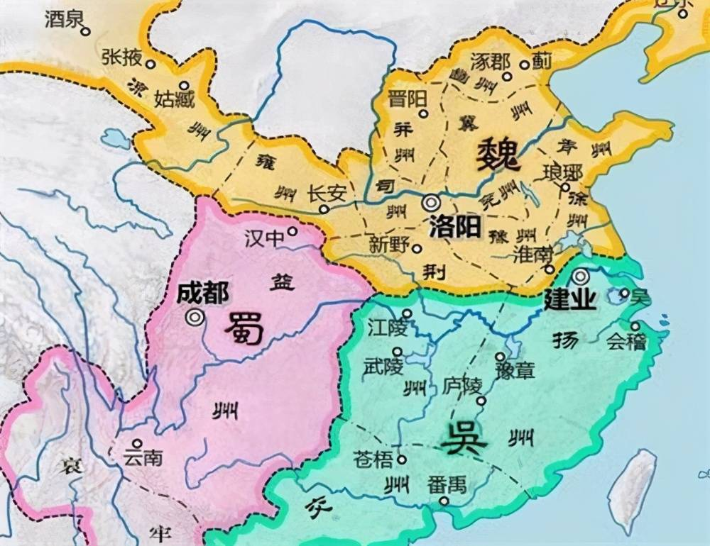

# 三国魏官员


## 司马防 {#simafang}

### 三国志·魏书一·武帝纪

《曹瞒传》曰：为尚书右丞司马建公`r n("司马防")`所举。及公为王，召建公到邺，与欢饮，谓建公曰："孤今日可复作尉否？"建公曰："昔举大王时，适可作尉耳。"王大笑。建公名防，司马宣王之父。臣松之案司马彪《序传》，建公不为右丞，疑此`r n("这件事")`不然，而王隐《晋书》云 `r n("自《晋书·赵王司马伦传》房玄龄")`赵王篡位，欲尊祖 `r n("司马防")`为帝，博士马平议 `r n("马平|马平议？")`称京兆府君昔举魏武帝为北部尉，贼不犯界，如此则为有征 `r n("证明")`。


## 曹爽

### 三国志·魏书九·曹爽传

爽字昭伯，少以 `r n("因为")` 宗室谨重 `r n("谨慎稳重[?]")` ，明帝 `r n("魏明帝曹叡（206年（存疑）—239年1月22日），字元仲，沛国谯县（今安徽省亳州市）人。曹魏第二位皇帝。魏文帝曹丕长子，母为文昭甄皇后。")` 在东宫，甚亲爱之。及即位，为散骑侍郎 `r n("入则规谏过失，备皇帝顾问，出则骑马散从")` ^[三国魏吴皆置，属散骑省，员额四人，五品。掌侍从左右，顾问应对、规劝得失；与散骑常侍等共平尚书奏事。西晋置，东晋罢。南朝复置，属集书省，掌文学侍从，收纳章奏，劝谏纠劾。北朝也置，且兼修国史。隋初属门下省，掌值班陪从；炀帝废。唐初复置，为加官，后改为文散官。参看“散骑省”、“门下省”、“散骑常侍”条。] ，累迁城门校尉 `r n("职掌京师城门守卫")` ^[城门校尉，它于汉武帝时初置，在汉代是一种不可或缺的军事力量，职掌京师城门守卫，东汉光武帝沿置之。城门校尉、执金吾与北军中候之间相互牵制，互不统属，共同组成了东汉中央宿卫系统中的城卫军。隋城门局属于门下省，设校尉二人，隋炀帝改校尉为城门郎。] ，加散骑常侍^[三国魏文帝黄初 (220—226) 初年置散骑，合于中常侍，谓之散骑常侍。西晋沿置，员四人，位比侍中，三品，秩比二千石，为门下重职，散骑省长官。职掌侍从皇帝左右，谏诤得失，顾问应对，与侍中等共平尚书奏事，有异议得驳奏。亦常用作宰相、诸公等加官，得入宫禁议政。至东晋，夺中书出令之权，参掌机密，选望甚重，职任比于侍中。]
，转武卫将军 `r n("掌宿卫禁军，权任很重")` ，宠待有殊。帝寝疾，乃引爽入卧内，拜大将军，假节钺，都督中外诸军事，录尚书事^[初为职衔名，始于东汉。当时政令、政务总于尚书台，太傅、太尉、大将军等加此名义始得总知国事，综理政务，成为真宰相。魏晋南北朝多以公卿权重者居之，总领尚书省政务，凡重号将军、刺史，皆得命曹授用，位在三公上。或以二人以上并录，参录，又有录尚书六条、关尚书七条事等名义。南朝宋孝武帝孝建(454—456)中，不欲威权外假，遂省。其后置省无常。南齐始单拜，成为正式官号，为尚书省长官。梁、陈以其威权过重，常缺不授。北魏、北齐亦定为官号，为尚书省长官，尚书令、仆射为其副贰，职权甚重，隋朝废。辽初曾拟授重臣]
，与太尉司马宣王并受遗诏辅少主。明帝崩，齐王 `r n("曹芳（232年－274年），字兰卿，魏明帝养子，是三国时曹魏第三代皇帝，在位15年。与其被迫退位之后继任的曹髦、曹奂合称三少帝")` 即位，加爽侍中^[三国魏、西晋置为门下之侍中省长官，员四人 (加官无定员) ，三品、秩千石，常侍卫皇帝左右，管理门下众事，侍奉生活起居，出行则护驾; 与门下其他官员同掌顾问应对，拾遗补阙，谏诤纠察，傧相威仪，平议尚书奏事，有异议得驳奏。或加予宰相、尚书等高级官员，令其出入殿省，入宫议政。东晋、南朝宋沿置，兼统宫廷内侍诸署，皆三品。]
，改封武安侯，邑万二千户，赐剑履上殿，入朝不趋，赞拜不名。丁谧画策 `r n("谋画策略")` ，使爽白天子，发诏转宣王为太傅，外以名号尊之，内欲令尚书奏事，先来由己，得制其轻重也。①爽弟羲为中领军，训武卫将军，彦 `r n("贤士")` 散骑常侍、侍讲^[官名。始见于汉。《后汉书·郅郓传》： “援皇太子《韩诗》，侍讲殿中”。《朱穆传》： “宜为皇帝选置师、傅及侍讲者。”时仅侍从皇帝、太子，讲授经义。三国后正式置官。多以明经博学者充任，不常置，无定员。魏、北魏、北齐均置，南朝齐置，称侍皇太子讲]
，其余诸弟，皆以列侯侍从，出入禁闼 `r n("同禁中、禁省，均指皇宫或宫门之内。闼即宫门，因不得擅入，故曰“禁闼”")` ，贵宠莫盛焉。南阳何晏、邓飏、李胜、沛国丁谧、东平毕轨咸 `r n("普遍")` 有声名，进趣 `r n("进趋。努力向上；立志有所作为")` 于时，明帝以其浮华，皆抑黜 `r n("亦作“抑絀 ”。贬废；排斥")` 之。及爽秉政，乃复进叙 `r n("谓按等级次第以进职或奖功")` ，任为腹心。飏等欲令爽立威名于天下，劝使伐蜀，爽从其言，宣王止之不能禁。正始 `r n("三国魏齐王曹芳年号(240—249)。凡十年")` 五年，爽乃西至长安，大发卒六七万人，从骆谷 `r n("在今陕西周至县西南。谷长四百余里，为关中与汉中之间交通要道")` 入。是时，关中及 `r n("和,与")` 氐、羌转输 `r n("运输")` 不能供，牛马骡驴多死，民夷 `r n("犹民众。古代用于少数民族")` 号泣道路。入谷行数百里，贼因山为固，兵不得进。爽参军 `r fn("亦作“参军事”。东汉末车骑将军幕府置为僚属，掌参谋军务。曹操为丞相时，总揽军政，其僚属常有参丞相军事之名，职任颇重。西晋公以上领兵持节都督者，置参军六人，协助治理府事。东晋公府等所设僚属诸曹置，为诸曹长官，其人数依曹而异，不开府将军出征时亦置。南北朝王、公、将军府、都水台以及诸州多置为僚属，品级自六品至九品不等")` 杨伟为爽陈形势，宜急还，不然将败。②飏与伟争于爽前，伟曰：“飏、胜将败国家事，可斩也。”爽不悦，乃引军还。③

```{r map-sanguo, fig.cap="三国分界",echo=FALSE, fig.align='center', out.width='70%'}

```

①《魏书》曰：爽使弟羲为表曰：“臣亡父真 `r fn("I. 三国魏沛国谯人，字子丹。本姓秦，曹操哀其少孤，收养与诸子同。数从征伐，以偏将军击刘备别将，拜中坚将军。夏侯渊没于阳平，操以真为征蜀护军。曹丕即王位，以为镇西将军，假节都督雍、凉州诸军事，进封东乡侯。黄初三年，迁上军大将军。都督中外诸军事，假节钺。魏明帝太和二年，诸葛亮围祁山，南安、天水、安定三郡反魏应亮，真督军讨平之。官至大司马，赐剑履上朝，入朝不趋，封邵陵侯。卒谥元。II. 魏文帝时历为镇西将军、假节都督雍、凉州诸军事，上军大将军、都督中外诸军事。文帝病重，他受命与司马懿等辅政。明帝即位，拜大将军。先后破酒泉张进反叛、吴军牛渚屯、蜀将马谡。与将士同甘共苦，常以私财赏赐部下。卒后谥元侯")` 
，奉事三朝，入备冢宰 `r fn("相传为殷、周辅政大臣、百官之长。《尚书·伊训》：“百官总己以听冢宰。”《礼记·檀弓下》：“古者天子崩，王世子听于冢宰三年。”春秋战国泛指执掌国政的大臣。后世亦用以称宰相。唐代中后期，皇帝初崩，新君始立，从诸宰相中选一人摄冢宰，相当于首相之位。②《周礼》天官之长。亦作大(太)宰。居六卿之首，主管宫廷供御事务，参掌大政，总领百官及财赋之政。西魏末、北周建六官府，置为天官府长官。明清亦作为吏部尚书的别称。参见“大冢宰”、“天官府”。")` 
，出为上将。先帝以臣肺腑遗绪 `r n("前人留下来的功业")` ，奖（饰）〔饬〕拔擢，典兵禁省，进无忠恪 `r n("忠诚恭谨")` 积累之行，退无羔羊自公 `r fn("诗经《国风·召南》羔羊之皮，素丝五紽。退食自公，委蛇委蛇。羔羊之革，素丝五緎。委蛇委蛇，自公退食。羔羊之缝，素丝五总。委蛇委蛇，退食自公。薛汉《韩诗薛君章句》云：“诗人贤仕为大夫者，言其德能称，有洁白之性，屈柔之行，进退有度数也。”")` 
之节。先帝圣体不豫，臣虽奔走，侍疾尝药，曾 `r n("曾经")` 无精诚翼日 `r n("明日，次日。翼，通“翌 ”")` 之应，猥 `r n("谦词,等于说“辱”,指降低身分,用于他人对自己的行动")` 与太尉懿俱受遗诏，且惭且惧，靡所厎告 `r n("诉告。把自己的心意表达与人")` 。臣闻虞舜序贤，以稷、契为先，成汤褒功，以伊、吕为首，审选博举，优劣得所，斯诚辅世长民之大经，录勋报功之令典，自古以来，未之或阙。今臣虚暗，位冠朝首，顾惟越次，中心愧惕，敢竭愚情，陈写至实。夫天下之达道者三，谓德、爵、齿也。懿本以高明中正，处上司之位，名足镇众，义足率下，一也。包怀大略，允文允武，仍立征伐之勋，遐迩 `r n("远近")` 归功，二也。万里旋旆 `r n("xuán pèi。回师")` ，亲受遗诏，翼亮 `r n("辅佐并使其发扬光大")` 皇家，内外所向，三也。加之耆艾，纪纲邦国，体练朝政。论德则过于吉甫 `r fn("周宣王 贤臣 尹吉甫。泛指贤能宰辅")` 
、樊仲 `r n("仲山甫。或作仲山父。西周人。周宣王之大臣。名失传。封于樊，亦称樊仲、樊仲山父、樊穆仲。宣王战败，丧失军队甚夥，乃欲登计民数于太原。仲山甫劝谏。后辅佐宣王，尹吉甫尝作《烝民》之诗以称扬其德")` ，课功 `r n("考核功绩")` 则逾于方叔 `r n("西周人。周宣王时卿士。曾率兵车三千辆南征荆楚，北伐玁狁，有功于周")` 、召虎 `r n("或作召伯虎。西周人，名虎。召公奭后裔。封于召。周厉王虐，虎谏，王不听，以卫巫监谤。虎再谏，又不听。终为国人所逐，流于彘。太子靖避居于召虎家，虎以己子替死。厉王死，拥立靖为宣王。时淮夷不服，宣王命虎率师讨平之。宣王加封申伯地，虎为之经营。卒谥穆，称召穆公。")` `r co("以子替死，黑心也")` 。凡此数者，懿实兼之。臣抱空名而处其右，天下之人将谓臣以宗室见私，知进而不知退。陛下岐嶷，克明克类，如有以察臣之言，臣以为宜以懿为太傅、大司马，上昭陛下进贤之明，中显懿身文武之实，下使愚臣免于谤诮。” `r co("至此乃曹羲进表。故贬己抬懿，行捧杀之实")` 于是帝使中书监刘放、令孙资为诏 `r co("八岁小儿，怎知如何下诏。乃中书监代拟也")` 曰：“昔吴汉 `r fn("东汉南阳宛人，字子颜。初为亭长，王莽末亡命至渔阳，以贩马为业。后归刘秀，从征王郎，为偏将军。后与诸将拥刘秀为帝，任大司马，封舞阳侯。镇压铜马、重连、高湖、青犊、五校等军，击灭秦丰、刘永、董宪等，平定东方。又随刘秀西击隗嚣。建武十一年，率军伐蜀，次年灭蜀，尽杀公孙述宗族。卒谥忠。")` 
佐光武，有征定四方之功，为大司马，名称于今。太尉体履 `r n("秉性和行为")` 正直，功盖海内，先帝本以前后欲更其位者辄不弥久 `r n("长久")` ，是以迟迟不施行耳。今大将军荐太尉宜为大司马，既合先帝本旨，又放推让 `r n("逊让；推辞")` ，进德尚勋，乃欲明贤良、辩等列、顺长少也。虽旦、奭之属，宗师吕望 `r n("即 周 初人 吕尚 。 尚 年老。隐于渔钓， 文王 出猎，遇于 渭 滨，与语大悦，曰：“吾 太公 望子久矣。”故号之曰 太公望 。后世亦称 吕望 。《楚辞·离骚》：“ 吕望 之鼓刀兮，遭 周文 而得举")` ，念在引领 `r n("期望殷切")` 以处其下，何以过哉！朕甚嘉焉。朕惟先帝固知君子乐天知命，纤芥细疑，不足为忌，当顾柏人 `r fn("《史记·张耳陈馀列传》：“汉 八年，上从 东垣 还，过 赵 ，贯高 等乃壁人 柏人 ，要之置厕。上过欲宿，心动，问曰：‘县名为何？’曰：‘柏人 。’‘柏人者，迫於人也！’不宿而去。”后遂用为皇帝行止戒备的典故。")` 
彭亡 `r fn("在今四川彭山县东北十里江口镇。《后汉书·岑彭传》：建武十一年(35)，岑彭率大军伐公孙述，进至武阳，“彭所营地名彭亡，闻而恶之，欲徙，会日暮，蜀刺客诈为亡奴降，夜刺杀彭”。即此。")` 
之文，故用低佪，有意未遂耳。斯亦先帝敬重大臣，恩爱深厚之至也。昔成王建保傅 `r n("太保、太傅或太子太保、太子太傅之合称。")` 之官，近汉显宗以邓禹为太傅，皆所以优崇俊乂 `r n("jùn yì。才德出众的人")` ，必有尊也。其以太尉为太傅。”②《世语》曰：伟字世英，冯翊 `r fn("三国魏改左冯翊置，治所在临晋县(今陕西大荔县)。辖境相当今陕西韩城市、洛川县以南，宜君、蒲城二县以东，渭河以北地区。北魏移治高陆县(今陕西高陵县)。辖境缩小。北周废。隋大业三年(607)复置于冯翊县(今大荔县)。唐武德元年(618)改为同州。天宝元年(742)复改冯翊郡，乾元元年(758)又改为同州。")` 
人。明帝治宫室，伟谏曰：“今作宫室，斩伐生民墓上松柏，毁坏碑兽石柱，辜及亡人，伤孝子心，不可以为后世之法则。” `r co("言其忠君爱民")` ③《汉晋春秋》曰：司马宣王谓夏侯玄曰：“《春秋》责大德重，昔武皇帝再入汉中，几至大败，君所知也。今兴平路势至险，蜀已先据。若进不获 `r n("得以,能够")` 战，退见徼 `r n("边界,边境。或通“侥”")` 绝，覆军必矣。将何以任其责！”玄惧，言于爽，引军退。费祎进兵据三岭以截爽，爽争崄苦战，仅乃得过。所发牛马运转者，死失略尽，羌、胡怨叹，而关右悉虚耗矣。

#### 初 {#三国志-曹爽-初}

初，爽以宣王年德并高，恒 `r n("经常,常常")` 父事 `r n("把别人当做父亲一般侍奉")` 之，不敢专行。及晏等进用 `r n("拔擢任用")` ，咸共推戴，说爽以权重不宜委之于人。乃以晏、飏、谧为尚书 `r fn("官名。始置于 战国 时，或称掌书，尚即执掌之义。秦 为少府属官， 汉武帝 提高皇权，因尚书在皇帝左右办事，掌管文书奏章，地位逐渐重要。 汉成帝 时设尚书五人，开始分曹办事。 东汉 时正式成为协助皇帝处理政务的官员，从此三公权力大大削弱。 魏 晋 以后，尚书事务益繁。 隋 代始分六部， 唐 代更确定六部为吏、户、礼、兵、刑、工。从 隋 唐 开始，中央首要机关分为三省，尚书省即其中之一，职权益重。 宋 以后三省分立之制渐成空名，行政全归尚书省。 元 代存中书省之名，而以尚书省各官隶属其中。 明 初犹沿此制，其后废去中书省，径以六部尚书分掌政务，六部尚书遂等于国务大臣， 清 代相沿不改。")` ，晏典 `r n("主持；主管")` 选举，轨 `r n("依循，遵循")` 司隶校尉 `r fn("官名。西汉武帝征和四年(前89)始置，秩二千石。初掌管理使役在中央诸官府服役的徒隶，领一千二百人，持节，亦捕治罪犯。后罢其兵，职掌纠察京都百官及京师附近的三辅(京兆、左冯翊、右扶风)、三河(河东、河内、河南)、弘农七郡的犯法者，职权渐重。属官有从事掾、史，假佐等。元帝初元四年(前45)去节。成帝元延四年(前9)省，哀帝即位后复置，改名司隶，隶大司空，位比司直。东汉仍名司隶校尉，秩比二千石，而威权尤重。凡宫廷内外，皇亲贵戚，京都百官，无所不纠，兼领兵，有检勑、捕杀罪犯之权，并为司隶州行政长官，辖前述七郡。治所在河南洛阳。光武帝特诏朝会时与御史中丞、尚书令并专席而坐，时号“三独坐”。东汉末权臣往往自兼此职以控制京师。所设机构较西汉复杂，属官有都官、功曹、别驾、簿曹、兵曹、部郡国等从事史十二员，假佐二十五员。三国魏沿置，先治弘农，后治河南，辖司州所属河南、河东、河内、弘农、平阳五郡，三品。属官有从事史、假佐一百员，增设诸曹、武猛、督军从事等。蜀亦置，掌督察京师，但不典益州事，常以重臣兼领。西晋沿魏制，三品。东晋罢，其职归扬州刺史。十六国多置。北魏初曾置，旋罢，其职归司州牧、司州刺史。")` ，胜 `r n("通“升”")` 河南尹，诸事希 `r n("假借为“稀”。稀少;罕见")` 复由宣王。宣王遂称疾避爽。①晏等专政，共分割洛阳、野王典农部桑田数百顷，及坏汤沐地 `r n("周制，诸侯朝见天子时，天子在王畿之内赐其封邑，以供其膳宿和斋戒沐浴之用，故称汤沐邑。汉朝皇帝、皇后、公主以及诸侯王、列侯收取赋税以供其私人奉养的封邑，亦称汤沐邑。《汉书 ·高帝纪》颜师古注： “凡言汤沐邑者，谓以其赋税供汤沐之具也。”")` 以为产业，承势窃取官物，因缘求欲州郡。有司 `r n("官吏和官署泛称。古代设官分职，各有专司，故称。《牧簋铭》：“命汝辟百寮、有司事。”《汉书·文帝纪》：“有司请令县道，人八十已上，赐米人月一石、肉二十斤、酒五斗。”《晋书·石崇传》：“有司承旨奏(石)统，将加重罚。”")` 望风，莫敢忤旨。晏等与廷尉 `r fn("官名。亦称廷尉卿。战国秦始置，秦、西汉沿置。景帝中六年 (前144)改名大理，武帝建元四年(前137)复旧。秩中二千石，列位九卿，为中央最高司法审判机构长官，遵照皇帝旨意修订法律，汇总全国断狱数，主管诏狱。文武大臣有罪，由其直接审理收狱，重大案件由皇帝派人会审。又为地方司法案件的上诉机关，负责复核审决郡国疑狱，或上报皇帝，有时也派员至郡国协助审理重要案件。属官有正，左、右监，宣帝时增置左、右平。哀帝元寿二年 (前1) 改名大理。新莽改名作士。东汉复名廷尉，省右平、右监。当时御史中丞、司隶校尉也有治狱奏谳之责，重大案件或由三方会审。魏、晋、南朝沿置，属官有丞、正、监、平、律博士各一员。当时修订法律及刑狱之政令仰承尚书省，南朝又置“建康三官”分掌刑狱，廷尉职权较汉为轻。魏、晋、宋三品。梁、陈定名“廷尉卿”。北魏或称廷尉卿，又增设少卿为之副贰，其余属官略同，孝庄帝永安二年 (529)又置司直十人，覆审御史检劾案件。孝文帝太和十七年(493) 定为二品上，二十三年改三品。北齐初沿置，后改置“大理卿”")` 卢毓 `r n("yù")` 素有不平，因毓吏微过，深文 `r n("谓制定或援用法律条文苛细严峻")` 致毓法 `r n("依法处治")` ，使主者先收毓印绶，然后奏闻。其作威如此。爽饮食车服，拟于乘舆 `r n("shèng yú。古代特指天子和诸侯所乘坐的车子，泛指皇帝用的器物")` ；尚方珍玩，充牣 `r n("chōng rèn。充满")` 其家；妻妾盈后庭，又私取先帝才人七八人，及将吏 `r n("文武官员的合称")` 、师工 `r n("《国语·楚语上》：“临事有瞽史之导，宴居有师工之诵。” 韦昭 注：“师，乐师也；工，瞽矇也。诵，谓箴諫时世也。”")` 、鼓吹 `r n("演奏乐曲的乐队")` 、良家子女三十三人，皆以为伎乐。诈作诏书，发才人五十七人送邺台 `r n("曹操为魏王，在邺起冰井﹑铜雀﹑金虎三台。其中铜雀台最有名。")` `r fn("建安五年，曹操击败袁绍，于邺建都漳河畔大兴土木修建铜雀台，高十丈，分三台，各相距六十步远，中间各架飞桥相连。建安十八年（213年），曹操又在铜雀台南方建一金虎台。次年（214年），又在铜雀台北建一冰井台，合称为“三台”。《水经注·卷五·浊漳水》记载：“在邺城的西北隅，以墙为基，台高十丈，有屋百余间……巍然崇举，其高若山”。")` ，使先帝倢伃 `r n("倢伃，汉武帝置，为妃嫔之首。元帝时因增设昭仪，退居第二。曹魏时退居十二等中的第九。晋时尚在九嫔之内。南朝宋以下，降至九嫔以下，至清废。")` `r fn("倢伃，其名之意，据《汉书·外戚传》颜师古注，“倢，言接幸于上也。伃，美称也。”")` 教习为伎。擅取太乐乐器，武库禁兵。作窟室 `r n("春秋 郑 伯有 为窟室，彻夜饮酒欢娱，后借指畅饮欢娱之所")` ，绮疏 `r n("亦作“綺疎 ”。指雕刻成空心花纹的窗户")` 四周，数与晏等会其中，纵酒作乐。羲深以为大忧，数谏止之。又著书三篇，陈骄淫盈溢之致祸败，辞旨甚切，不敢斥爽，托戒诸弟以示爽。爽知其为己发也，甚不悦。羲或时 `r n("有时")` 以谏喻不纳，涕泣而起。宣王密为之备。九年冬，李胜出为荆州刺史，往诣宣王。宣王称疾困笃，示以羸形 `r n("形体瘦弱；瘦弱的形体")` 。胜不能觉，谓之信然。②

①初，宣王以爽魏之肺腑，每推先之，爽以宣王名重，亦引身卑下，当时称焉。丁谧、毕轨等既进用，数言于爽曰：“宣王有大志而甚得民心，不可以推诚委之。”由是爽恒猜防焉。礼貌虽存，而诸所兴造，皆不复由宣王。宣王力不能争，且惧其祸，故避之。②《魏末传》曰：爽等令胜辞 `r n("辞别;告别")` 宣王，并伺察焉。宣王见胜，胜自陈无他功劳，横蒙 `r n("意外蒙受；过分蒙受")` （时）〔特〕恩，当为本州 `r n("指家乡所在的州")` ，诣 `r n("qi前往")` 阁拜辞，不悟 `r n("了解；领会")` 加恩，得蒙引见。宣王令两婢侍边，持衣，衣落，复上指口，言渴求饮，婢进粥，宣王持杯饮粥，粥皆流出沾胸。胜愍然 `r n("mǐn rán。怜悯貌")` ，为之涕泣，谓宣王曰：“今主上尚幼，天下恃赖明公。然众情谓明公方旧风疾发，何意尊体乃尔！”宣王徐更宽言，才令气息相属 `r n("xiāng zhǔ。相接连；相继")` ，说：“年老沉疾，死在旦夕。君当屈并州，并州近胡，好善为之，恐不复相见，如何！”胜曰：“当还忝 `r n("tiǎn。表示愧于进行某事。用作谦词")` 本州，非并州也。”宣王乃复阳 `r n("假装")` 为昏谬，曰：“君方到并州，努力自爱。”错乱其辞，状如荒语。胜复曰：“当忝荆州，非并州也。”宣王乃若微悟者，谓胜曰：“懿年老，意荒忽，不解君言。今还为本州刺史，盛德壮烈，好建功勋。今当与君别，自顾气力转微，后必不更会，因欲自力，设薄 `r n("薄设 [báo shè]，设小酌、便宴")` 主人，生死共别。令师、昭兄弟结君为友，不可相舍去，副 `r n("交付,付与")` 懿区区之心。”因流涕哽咽，胜亦长叹，答曰：“辄当承教，须待 `r n("等待")` 敕命。”胜辞出，与爽等相见，说：“太傅语言错误，口不摄杯，指南为北。又云吾当作并州，吾答言当还为荆州，非并州也。徐徐与语，有识人时，乃知当还为荆州耳。又欲设主人祖送 `r n("犹饯行。祖饯送行")` ，不可舍去 `r n("喻离开住所到别处")` ，宜须待之。”更向爽等垂泪云：“太傅患不可复济，令人怆然。”

#### 正始十年（249年） `r fn("亦嘉平元年")`

十年正月，车驾朝高平陵，爽兄弟皆从。①宣王部勒 `r n("统率")` 兵马，先据武库 `r n("储藏兵器的仓库")` ，遂出屯洛水浮桥。奏爽曰：“臣昔从辽东还，先帝诏陛下、秦王及臣升御床，把臣臂，深以后事为念。臣言‘二祖 `r n("曹操，曹丕")` 亦属臣以后事，（为念）此自陛下所见，无所 `r n("表示否定不必明言或不可明言的人或事物")` 忧苦。万一有不如意，臣当以死奉明诏’。黄门令董箕等，才人侍疾者，皆所闻知。今大将军爽背弃顾命，败乱国典，内则僭拟，外专威权；破坏诸营，尽据禁兵，群官要职，皆置所亲；殿中宿卫，历世旧人皆复斥出，欲置新人以树私计；根据槃牙，纵恣日甚。外既如此，又以黄门张当为都监，专共交关，看察至尊，候伺神器，离间二宫，伤害骨肉。天下汹汹，人怀危惧，陛下但为寄坐，岂得久安！此非先帝诏陛下及臣升御床之本意也。臣虽朽迈，敢忘往言？昔赵高极意，秦氏以灭；吕、霍早断，汉祚永世。此乃陛下之大鉴，臣受命之时也。太尉臣济、尚书令臣孚等，皆以爽为有无君之心，兄弟不宜典兵宿卫，奏永宁宫。皇太后令敕臣如奏施行。臣辄敕主者及黄门令罢爽、羲、训吏兵，以侯就第，不得逗留以稽车驾，敢有稽留，便以军法从事。臣辄力疾将兵屯洛水浮桥，伺察非常。”② `r co("此奏并松之注可与 [《晋书·宣帝·嘉平元年》](#晋书-宣帝-嘉平元年) 比对揣摩")` 

①《世语》曰：爽兄弟 `r n("爽、羲")` 先是数俱出游，桓范谓曰：“总万机，典禁兵，不宜并出，若有闭城门，谁复内入者？”爽曰：“谁敢尔邪！”由此不复并行。至是乃尽出也。 `r co("谓之不自制，或恒范言微")` ②《世语》曰：初，宣王勒兵从阙下趣 `r n("通“趋”。趋向;奔向")` 武库，当 `r n("面对着")` 爽门，人逼车住 `r n("停止")` 。爽妻刘怖，出至厅事，谓帐下守督 `r n("严世")` 曰：“公在外，今兵起，如何？”督曰：“夫人勿忧。”乃上门楼，引弩注箭欲发。将孙谦在后牵止之曰：“天下事未可知！”如此者三，宣王遂得过去。

##### 爽得宣王奏事 {#三国志-曹爽-爽得宣王奏事}

爽得宣王奏事，不通，迫窘不知所为。①大司农 `r fn("①官名。西汉武帝太初元年(前104)改大农令置。简称大农。秩中二千石，列位九卿。掌管全国租赋收入和国家财政开支，凡百官俸禄、军费、各级政府机构经费等由其支付，管理各地仓储、水利，官府农业、手工业、商业的经营，调运货物，管制物价等。有丞二员，部丞若干员。属官有太仓、均输、平准、都内、籍田五令丞，斡官、铁市两长丞。郡国诸仓、农监、都水六十五官长，边郡的农都尉等屯田官员，亦皆属之。新莽先后改名羲和、纳言。东汉复故，机构减省，置丞、部丞各一员，属官有太仓、平准、导官三令丞，余皆罢省。地方都水、盐铁等官划归郡县主管。原属少府管理的帝室财政开支则并归大司农。三国沿置。魏三品，当时在诸郡县置有典农中郎将、校尉、都尉等屯田官，亦皆属之。西晋领太仓、籍田、导官三令，襄国都水长，东西南北部护漕掾，三品。东晋南北朝国家财政归尚书省主管，大司农或置或省，所掌惟仓储园苑及供膳之庶务。晋哀帝时曾省并都水台，孝武帝宁康元年(373)复置。南朝宋文帝元嘉二十九年(452)省，孝武帝大明四年(460)复置，三品。丞一员。领太仓、导官、籍田令丞。梁改名“司农卿”。北魏仍置，孝文帝太和十七年(493)定为二品上，二十三年复次职令，改三品。北齐改名“司农卿”。金朝复置，掌管农政，兼监察各地官吏，为司农司长官，正二品。属官有司农卿三员，司农少卿三员。又领各路行司农司。元朝仁宗皇庆二年(1313)置四员，为大司农司长官，管理农桑、水利、学校、饥荒之事，从一品。属官有卿二员，少卿二员，丞二员。② “户部尚书”别称。")` 沛国桓范闻兵起，不应太后召，矫诏开平昌门，拔取剑戟，略将门候 `r fn("官名。主城门或军营门。西汉城门校尉属官有十二城门候，掌按时开闭城门。东汉沿置。城门每门候一人，六百石。又，诸将军营部亦置。隋朝为左右监门府属官。隋高祖仁寿三年 (603)于监门府置门候一百二十人。炀帝时增至二百四十人，正七品，与左右门尉分掌门禁守卫。")` ，南奔爽。宣王知，曰：“范画策，爽必不能用范计。”范说爽使车驾幸许昌，招外兵。爽兄弟犹豫未决，范重谓羲曰：“当今日，卿门户求贫贱复可得乎？且匹夫持质一人，尚欲望活，今卿与天子相随，令于天下，谁敢不应者？”羲犹不能纳。侍中许允、尚书陈泰说爽，使早自归罪。爽于是遣允、泰诣宣王，归罪请死，乃通宣王奏事。②遂免爽兄弟，以侯还第。③

①干宝《晋纪》曰：爽留车驾宿伊水 `r n("洛水支流。源出河南栾川县伏牛山北麓，东北流至偃师县南入洛水。")` 南，伐木为鹿角，发 `r n("派遣")` 屯甲兵数千人以为卫。《魏末传》曰：宣王语弟孚，陛下在外不可露宿，促送帐幔、太官食具诣行在所。 `r co("障眼法？")` ②干宝《晋书》曰：桓范出赴爽，宣王谓蒋济曰：“智囊往矣。”济曰：“范则智矣，驽马恋栈豆，爽必不能用也。”《世语》曰：宣王使许允、陈泰解语爽，蒋济亦与书达宣王之旨，又使爽所信殿中校尉尹大目谓爽，唯免官而已，以洛水为誓。爽信之，罢兵。《魏氏春秋》曰：爽既罢兵，曰：“我不失作富家翁。”范哭曰：“曹子丹 `r n("曹真")` 佳人，生汝兄弟，犊 `r co("言其犹如小儿")` 耳！何图 `r n("哪里想到")` 今日坐汝等族灭矣！”③《魏末传》曰：爽兄弟归家。敕洛阳县发民八百人，使尉部围爽第四角，角作高楼，令人在上望视爽兄弟举动。爽计穷愁闷，持弹到后园中，楼上人便唱言“故大将军东南行！”爽还厅事上，与兄弟共议，未知宣王意深浅，作书与宣王曰：“贱子爽哀惶恐怖，无状招祸，分受屠灭。前遣家人迎粮，于今未反 `r n("通“返”")` ，数日乏匮，当烦见饷 `r n("食物")` ，以继旦夕。”宣王得书大惊，即答书曰：“初不知乏粮，甚怀踧踖 `r n("恭敬不安，意谓恭敬而不自然的样子")` 。令致米一百斛，并肉脯、盐豉、大豆。”寻送。爽兄弟不达变数，即便喜欢，自谓不死。

##### 爽等伏诛 {#三国志-曹爽-爽等伏诛}

初，张当私以所择才人张、何等与爽，疑其有奸，收当治罪。当陈爽与晏等阴谋反逆，并先习兵，须三月中欲发，于是收晏等下狱 `r co("懿早备，唯爽不知尔。见[《晋书》](#晋书-司马懿-正始九年)")` 。会公卿朝臣廷议，以为“《春秋》之义，‘君 `r n("君主")` 亲 `r n("父母")` 无将 `r n("叛乱")` ，将而必诛’。爽以支属，世蒙殊宠，亲受先帝握手遗诏，托以天下，而包藏祸心，蔑弃顾命，乃与晏、飏及当等谋图神器，范党同罪人，皆为大逆不道”。于是收爽、羲、训、晏、飏、谧、轨、胜、范、当等，皆伏诛，夷三族。①嘉平中，绍 `r n("绍封")` 功臣世，封真族孙熙为新昌亭侯，邑三百户，以奉真后。②

①《魏略》曰：**邓飏**字玄茂，邓禹后也。少得士名于京师。明帝时为尚书郎，除洛阳令，坐事免，拜中郎，又入兼中书郎。初，飏与李胜等为浮华友，及在中书，浮华事发，被斥出，遂不复用。`r co("此乃少帝病弊")` 正始初，乃出为颍川太守，转大将军长史，迁侍中尚书。飏为人好货 `r n("贪爱财物")` ，前在内职，许臧艾授以显官，艾以父妾 `r co("小妈亦为财物，不伦。收之，不齿")` 与飏，故京师为之语曰：“以官易妇邓玄茂。”每所荐达，多如此比。故何晏选举不得人，颇由飏之不公忠，遂同其罪，盖由交友非（奇）〔其〕才。（魏略曰）**丁谧**字彦靖。父*斐*字文侯。初，斐随太祖，太祖以斐乡里，特饶爱之。斐性好货，数请求犯法，辄得原宥 `r n("原谅宽恕")` 。为典军校尉，总摄内外，每所陈说，多见从之 `r co("曹操信之，盖因其有才能")` 。建安末，从太祖征吴。斐随行，自以家牛羸困 `r n("疲惫，瘦弱困乏")` ，乃私易官牛，为人所白，被收送狱，夺官。其后太祖问斐曰：“文侯，印绶所在？”斐亦知见戏，对曰：“以易饼耳。”太祖笑，顾谓左右曰：“东曹 `r fn("①官署名。西汉丞相府所属诸曹之一。东汉时三公府亦置。据《后汉书·百官志》，太尉所属东曹主二千石长吏迁除选举及军吏。领其事者为东曹掾，秩比四百石。汉末曹操于相府亦置东、西曹，皆典选举。东曹典府外官吏。三国魏大将军、丞相(相国)，蜀丞相、大司马及吴车骑将军等并置。西晋初，诸公及开府位从公者皆置，位在西曹下，赵王伦为相国时增置属吏。西晋末，丞相府一度置参军主东曹事。东晋省。十六国又置，南朝宋、齐亦置。梁于诸公府置，以督护主之。②部落名。十六国前秦建元三年(367)匈奴右贤王死，秦分其部落为二，使其二子分统之，号东、西曹。")` 毛掾数白此家，欲令我重治，我非不知此人不清，良 `r n("的确，诚然")` 有以 `r n("所以，原因")` 也。我之有斐，譬如人家有盗狗而善捕鼠，盗虽有小损，而完我囊贮 `r n("贮于袋中的物品")`  `r co("曹操视斐为盗狗，斐亦知也，反以为荣。一主一狗，其乐融融")` 。”遂复斐官，听用如初。后数岁，病亡。谧少不肯交游，但博观书传。为人沉毅，颇有才略。太和 `r n("三国魏明帝年号(227—233)。凡七年。")` 中，常住邺，借人空屋，居其中。而诸王亦欲借之，不知谧已得，直开门入。谧望见王，交脚卧而不起，而呼其奴客曰：“此何等人？促呵使去。”王怒其无礼，还具上言。明帝收谧，系邺狱，以其功臣子，原 `r n("宽恕，赦免")` 出。后帝闻其有父风 `r co("可见斐之才略")` ，召拜度支郎中 `r fn("官名，也称度支郎。魏晋南北朝尚书省（台）置尚书曹，度支郎为曹长官，掌贡税租赋的统计、调拨、支出等。至唐朝，只称度支郎中而不再称度支郎，掌全国租税物产，水陆道途之利，每年计算收入与支出。宋朝也置，掌计算军费，根据全国租税贡赋的收入而制订开支计划。清朝末年度支部也置度支郎中。见《旧唐书·职官二·度支郎中》、《新唐书·百官一·户部》、《宋史·职官三·度支郎中》、《清史稿·职官六·度支郎中》。")` 。曹爽宿与相亲，时爽为武卫将军，数为帝说其可大用。会帝崩，爽辅政，乃拔谧为散骑常侍，遂转尚书。谧为人外似疏略 `r n("远大的谋略，或指粗略;粗心大意")` ，而内多忌。其在台阁 `r fn("①东汉至隋、唐对尚书台 (省) 的别称。《后汉书 ·仲长统传》： “虽置三公，事归台阁。”李贤注： “台阁谓尚书也。”②指御史台、秘书监。《三国志·王肃传》裴松之注引《魏略》： “兰台为外台，秘书为内阁，台阁一也。”③北宋对御史台官、诸阁职的简称。")` ，数有所弹驳，台中患之，事不得行。又其意轻贵，多所忽略，虽与何晏、邓飏等同位，而皆少 `r n("轻视,看不起")` 之，唯以势屈于爽。爽亦敬之，言无不从。故于时谤书，谓“台中有三狗，二狗崖柴 `r n("形容张口欲咬人之状")` 不可当，一狗凭 `r co("倚靠爽")` 默作疽囊 `r n("毒疮植根处，常用来暗喻群恶聚集之所")` ”。三狗，谓何、邓、丁也。[默者，爽小字也]{.underline}。其意言三狗皆欲啮人，而谧尤甚也。奏使郭太后出居别宫 `r co("郭太后手段非常")` `r fn("黄初二年（221年），曹丕遣使赐死在邺城的甄夫人，这是因郭贵嫔受宠所致。《资治通鉴》《魏略》以及《汉晋春秋》记载，郭氏以谗言谮害甄氏，曹丕遂大怒赐死")` ，及遣乐安王使北诣邺，又遣*文钦*令还淮南，皆谧之计。`r co("才略只作阴谋")` 司马宣王由是特深恨之。**毕轨**字昭先。父字子礼，建安中为典农校尉。轨以才能，少有名声。明帝在东宫时，轨在文学中 `r fn("官名，文学掾、文学史及太子文学的简称。汉朝州郡和王国皆置，以通晓经书者担任，掌管学校教育，教授诸生，或掌典章故事，备顾问侍从。三国魏置太子文学，诸王和侯国也置。晋朝诸王及世子置。南朝宋、齐王国置，梁、陈皇弟、皇子府置，北魏、北齐皇子置。隋、唐亲王府置，掌校勘典籍、侍从文章。唐德宗时改诸州经学博士为文学，掌以五经教授诸生，见《通典·职官十二》、《晋书·职官志》、《新唐书·百官四下》。")` 。黄初末 `r co("曹丕即位")` ，出为长史。明帝即位，入为黄门郎，子尚 `r n("娶帝王之女为妻")` 公主，居处殷富。迁并州刺史。其在并州，名为骄豪。时杂虏数为暴，害吏民，轨辄出军击鲜卑轲比能 `r fn("轲比能“勇健，断法平端，不贪财物”，众人推举他为大人（首领）。他的部落接近汉的北方边境，自从袁绍据河北后，有不少汉人逃到塞外投靠轲比能，他们教晓鲜卑人“作兵器铠楯”，又教授文字。轲比能仿效中原方式管理部众，“出入弋猎，建立旌麾，以鼓节为进退”。他曾经协助曹操敉平地方叛乱，也曾经侵扰汉境，被曹彰打得大败，退出塞外。轲比能后来恢复向中原政权贡献。220年，轲比能遣使献马，曹丕立他为附义王。其后轲比能与东部鲜卑大人素利及步度根争战。224年，轲比能又进攻素利，魏国出兵干预，打败了轲比能的部下琐奴，轲比能于是致书向魏解释。此后轲比能的部众变得强盛，“控弦十余万骑”。他每次掠得财物，均与众平分，“终无所私，故得众死力，余部大人皆敬惮之”，然犹未能及得上以前檀石槐时期的强大。228年，其女婿郁筑鞬遭田豫攻击，派三万骑兵相救，经阎志劝解，带兵离去。233年，轲比能引诱步度根结和亲，于是步度根归附轲比能，侵袭并州。后来轲比能杀了步度根。235年，魏幽州刺史王雄派刺客韩龙杀死轲比能，立其弟为首领。《晋书》称轲比能之后为契丹。")` ，失利。中护军 `r fn("官名。东汉置，掌军中参谋、协调诸部。《后汉书 ·班彪列传下》： 明帝永元(58—75)初，“大将军窦宪出征匈奴，以(班)固为中护军，与参谋。”献帝建安十二年(207)曹操改护军置。魏沿置，四品，资重者可迁护军将军，掌武官选举，与中领军同掌禁军，出征则督护诸将; 隶中领军 (领军将军)。入晋则不隶领军，亦不典武选，升三品，自领营兵; 东晋元帝永昌元年 (322) 省并入领军，明帝太宁二年 (324) 复分置，掌督护京师以外地方诸军。属官有长史、司马、功曹、主薄、五官，受命出征则置参军。南朝沿置，宋三品，梁十四班，陈三品、中二千石。北魏则侍臣带护军始加中字，孝文帝太和十七年 (493)定为二品中，二十三年定为三品。北齐三品，管四中关津，舆驾出则护驾，统东西南北四中郎将府及诸关尉、津尉，属官有长史、司马、功曹、五官、主簿、录事及诸曹参军。唐德宗贞元十二年 (796) 亦置，以宦官充任，为左右神威军监军使加号，以示尊宠。")` 蒋济表曰：“毕轨前失，既往不咎，但恐是后难可以再。凡人材有长短，不可强成。轨文雅智意，自为美器。今失并州，换置他州，若入居显职，不毁其德，于国事实善。此安危之要，唯圣恩察之。”至正始中，入为中护军，转侍中尚书，迁司隶校尉。素与曹爽善，每言于爽，多见从之。**李胜**字公昭。父*休*字子朗，有智略。张鲁 `r fn("字公祺，沛国丰(今属江苏)人。祖父张陵创立五斗米道。他初被益州牧刘焉授以督义司马，奉命与张修进攻汉中。后杀张修并收编其众，占据汉中。推行五斗米道，实行政教合一。境内安定，生产发展，户口增加。建安二十年(215)遣弟张卫迎战曹操于阳平关，兵败，封府库而奔巴中，不久降操，拜镇南将军，封阆中侯。卒后谥原侯。")` 前为镇北将军，休为司马，家南郑。时汉中有甘露降，子朗见张鲁精兵数万人，有四塞之固，遂建言赤气久衰，黄家当兴，欲鲁举号，鲁不听。会鲁破，太祖以其劝鲁内附，赐爵关内侯，署 `r n("代理、暂任或试充官职")` 散官骑从，诣邺。至黄初中，仕历上党、巨鹿二郡太守，后以年老还，拜议郎 `r fn("汉 代设置；为光禄勋所属郎官之一，掌顾问应对，无常事。 汉 秩比六百石。多征贤良方正之士任之。 晋 以后废")` 。胜少游京师，雅有才智，与曹爽善。明帝禁浮华，而人白胜堂有四窗八达，各有主名。用是被收，以其所连引者多，故得原，禁锢 `r n("监禁；关押")` 数岁 `r co("得原后为何被禁锢数岁")` 。帝崩，曹爽辅政，胜为洛阳令。夏侯玄为征西将军，以胜为长史。玄亦宿与胜厚。骆谷之役，议从胜出，由是司马宣王不悦于胜。累迁荥阳太守、河南尹。胜前后所宰守，未尝不称职，为尹岁余，厅事前屠苏 `r n("即罘罳 fú sī。一种屏风，设在门外")` 坏，令人更治之，小材一枚激堕，正挝 `r n("zhuā。敲打,击")` 受符吏 `r n("符官。道教指守护符箓的神官")` 石虎头，断之。后旬日，迁为荆州刺史，未及之官而败也。**桓范**字元则，世为冠族 `r n("显贵的豪门世族")` 。建安末，入丞相府。延康 `r n("延康（220年三月—十月）是东汉皇帝汉献帝刘协的第六个年号 [1]  ，共计7个月。是东汉的最后一个年号")` 中，为羽林左监^[官名。东汉置。秩六百石，隶属羽林中郎将，主羽林左骑。有丞一人。职掌宿卫宫禁，护从皇帝。]。以有文学，与王象等典集《皇览》。明帝时为中领军尚书，迁征虏将军、东中郎将，使持节都督青、徐诸军事，治下邳。与徐州刺史（邹）〔郑〕岐争屋，引节欲斩岐，为岐所奏，不直 `r n("不正；不公。《资治通鉴·后周太祖广顺二年》：“辛亥，敕：民有诉讼，必先歷县州及观使处决，不直，乃听讼於臺省。”")` ，坐 `r n("定罪")` 免还 `r n("恢复;还原")` 。复为兖州刺史，怏怏不得意。又闻当 `r n("张当")` 转为冀州牧。是时冀州统属镇北，而镇北将军*吕昭才*实仕进 `r n("入仕，做官")` ，本在范后。范谓其妻仲长曰：“我宁作诸卿，向三公长跪耳，不能为吕子展屈也。”其妻曰：“君前在东，坐 `r n("定罪")` 欲擅斩徐州刺史，众人谓君难为作下，今复羞为吕屈，是复难为作上也。”范忿其言触实，乃以刀环撞其腹。妻时怀孕，遂堕胎死 `r co("范不听妻，爽不听范。爽、范一丘之貉也。")` 。范亦竟称疾，不赴冀州。正始中拜大司农。范前在台阁，号为晓事，及为司农，又以清省 `r n("清平省约")` 称。范尝抄撮 `r n("摘录")` 《汉书》中诸杂事，自以意斟酌之，名曰《世要论》。蒋济 `r n("懿心腹")` 为太尉，尝与范会社下，群卿列坐有数人，范怀其所撰，欲以示济，谓济当虚心观之。范出其书以示左右，左右传之示济，济不肯视，范心恨之。因论他事，乃发怒谓济曰：“我祖薄德，公辈何似邪？”济性虽强毅，亦知范（壳）〔刚〕毅，睨而不应，各罢。范于沛郡，仕次在曹真后。于时曹爽辅政，以范乡里老宿，于九卿中特敬之，然不甚亲也。及宣王起兵，闭城门，以范为晓事，乃指召之，欲使领中领军。范欲应召，而其子谏之，以为车驾 `r n("天子出巡时乘坐的马车。后亦用为天子的代称。")` 在外，不如南出。范疑有顷 `r n("有顷。少顷,短时间")` ，儿又促之。范欲去而司农丞吏皆止范。范不从，乃突出至平昌城门，城门已闭。门候司蕃，故范举吏也，范呼之，举手中版 `r n("牍。古时书写用的木简,后也指书籍")` 以示之，矫曰：“有诏召我，卿促开门！”蕃欲求见诏书，范呵之，言“卿非我故吏邪，何以敢尔？”乃开之。范出城，顾谓蕃曰：“太傅图逆，卿从我去。”蕃徒行不能及，遂避侧。范南见爽，劝爽兄弟以天子诣许昌，征四方以自辅。爽疑，羲又无言。范自谓羲曰：“事昭然，卿用读书何为邪？于今日卿等门户倒矣！”俱不言。范又谓羲曰：“卿别营近在阙南，洛阳典农治在城外，呼召如意。今诣许昌，不过中宿，许昌别库，足相被假 `r n("授兵")` ，所忧当在谷食，而大司农印章在我身。”羲兄弟默然不从，（甲）〔中〕夜至五鼓 `r n("古代民间把夜晚分成五个时段，用鼓打更报时，所以叫作五更、五鼓或五夜")` ，爽乃投刀于地，谓诸从驾群臣曰：“我度太傅意，亦不过欲令我兄弟向己 `r n("向己。自相残杀")` 也。我独有以不合于远近耳！”遂进谓帝曰：“陛下作诏免臣官，报皇太后令。”范知爽首免而己必坐唱义 `r n("首倡大义；发动起义")` 也。上乃曰：“老子今兹坐卿兄弟族矣！”爽等既免，帝还宫，遂令范随从。到洛水浮桥北，望见宣王，下车叩头而无言。宣王呼范姓曰：“桓大夫何为尔邪？”车驾入宫，有诏范还复位。范诣阙拜章谢，待报。会司蕃诣鸿胪自首，具说范前临出所道。宣王乃忿然曰：“诬人以反，于法何应？”主者曰：“科律，反受其罪。”乃收范于阙下。时人持范甚急，范谓部官曰：“徐之，我亦义士耳。”遂送廷尉。 `r co("至此爽之爪牙皆陈清矣")` 《世语》曰：初，爽梦二虎衔雷公，雷公若二升碗，放着庭中。爽恶之，以问占者，灵台丞马训曰：“忧兵。”训退，告其妻曰：“爽将以兵亡，不出旬日。”《汉晋春秋》曰：安定皇甫谧 ^[出于安定皇甫氏，曾祖父为东汉太尉皇甫嵩，祖父是灞陵县令皇甫叔献，父皇甫叔侯，举孝廉。出后叔父，徒居新安。少家贫，边耕边读。学习废寝忘食。博览儒家经典百家，人称“书淫”。淡于名利。举孝廉而不行，相国征辟而不就。晋武帝屡下诏敦促，皆固辞，终身不仕，潜心著述。上表，武帝赠书一车。晚年患风痹疾。太康三年（282年）卒，时年六十八。子皇甫童灵、皇甫方回。] 以九年冬梦至洛阳，自庙出，见车骑甚众，以物呈庙云：“诛大将军曹爽。”寤 `r n("睡醒")` 而以告其邑人，邑人曰：“君欲作曹人之梦 ^[前499年，曹国有一名官员梦见庙中有一群人商讨灭亡曹国的事。曹叔振铎在梦中劝阻他们，请求他们等候一个叫公孙彊的人出现才再作商议，得到众人的同意。那官员尝试在曹国寻找公孙彊，但不成功。他临终时吩咐儿子，如果得知有一名叫公孙彊的人执政，便要流亡国外，以免遭祸] 乎？朝无公孙彊如何？且爽兄弟典重兵，又权尚书事，谁敢谋之？”谧曰：“爽无叔振铎之请，苟失天机则离矣，何恃于彊？昔汉之阎显 ^[阎显，(?-125)东汉河南荥阳(今河南荥阳东北)人。安帝元初四年(117)嗣为北宜春侯。妹为安帝皇后。建光元年(121)安帝亲政,封长社侯,诸弟并为卿校,执掌禁兵,干预朝政。与宦官江京等阴谋废皇太子刘保为济阴王。延光四年(125)安帝死,又与阎后定策禁中,立年幼之北乡侯刘懿为帝(即少帝)。太后临朝,遂以车骑将军、仪同三司专断朝政。少帝病死,宦官孙程等十九人拥立刘保为顺帝,遂被杀。] ，倚母后之尊，权国威命，可谓至重矣，阉人十九人一旦尸之，况爽兄弟乎？”《世语》曰：初，爽出，司马**鲁芝**留在府，闻有事，将营骑斫 `r n("zhuó。砍，攻击。")` 津门 `r n("东汉首都洛阳有十二门，南面西头门称津门，一名津阳门")` 出赴爽。爽诛，擢为御史中丞。及爽解印绶，将出，主簿**杨综**止之曰：“公挟主握权，舍此以至东市乎？”爽不从。有司奏综导爽反，宣王曰：“各为其主也。”宥 `r n("宽恕；原谅")` 之，以为尚书郎。芝字世英，扶风人也。以后仕进至特进光禄大夫。综字初伯，后为安东将军司马文王长史。臣松之案：夏侯湛 ^[夏侯湛的祖父夏侯威，是曹魏名将夏侯渊第四子，官至魏国的兖州刺史。父亲夏侯庄，官至淮南郡太守，母亲羊氏是景献皇后羊徽瑜的堂姐。夏侯湛有六弟五妹，其中一个妹妹夏侯光姬为晋元帝司马睿的生母。夏侯湛年幼就已经充满才华，他所写的文章宏富广博，而且善于构建新式词藻，容貌观止优美典雅。《世说新语·容止》曰：“潘安仁，夏侯湛并有美容，喜同行，时人谓之连璧。”] 为芝铭及干宝《晋纪》并云爽既诛，宣王即擢芝为并州刺史，以综为安东参军 ^[官名，“参军事”的省称，为王府、公府、军府、州府的佐吏。东汉将军等统兵出征时，则置参军事，掌佐主帅参谋军事。三国魏置正参军、行参军。西晋诸军府置为属官。晋朝以后的南北朝，凡亲王府、将军府、都督府都设参军，才成为正式官名；有的只称参军，有的加职务名称，如负责谋划的称咨议参军，负责文翰的称记室参军等。隋唐沿袭南北朝时的官制、内府、外府都设录事参军等；刺史僚属多以参军事为名，简称参军；州郡组织除长史、别驾、司马等为刺史的佐官以外，以录事参军为僚属的长官，总理内部一切事务，其下有录事一人；除此之外，分曹办事的有司功参军、司户参军、司田参军、司兵参军、司法参军、司士参军，其下还有不分曹的参军；参军的品级为从七品至从九品不等。宋元不设此官。明清两朝称经历为参军。民国前期将军府设参军，地位在将军之下；民国后期国民政府设参军处。]  。与《世语》不同。②干宝《晋纪》曰：蒋济以曹真之勋力，不宜绝祀 `r n("谓无后嗣，或谓亡国")` ，故以熙 `r n("孙熙")` 为后。济又病其 `r n("懿")` 言之失信于爽，发病卒。


