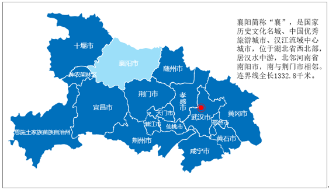
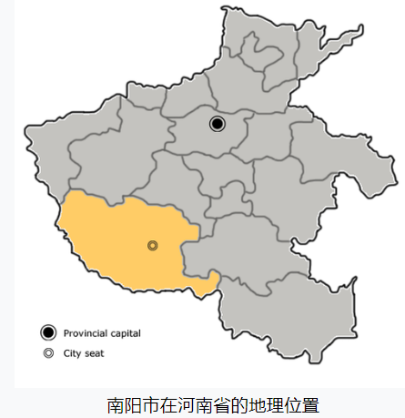

# 东晋帝

## 司马懿

### 《晋书·宣帝》

#### 魏武

汉建安 `r n("建安，是东汉末年汉献帝的第五个年号，使用时间从公元196年1月至公元220年3月")` 六年，郡举上计^[
I. 上計制是中國古代的一種行政制度。是由下一級政府就自己轄區內的年度政績製作文書，呈交給上一級政府。上一級政府通過對上計文書的審查來對地方政府的政績進行考核，同時監督地方的行政。這種制度歷史悠久，源於戰國，在秦漢時發展得較為完備。
II. 隨着郡縣制的劃分，漢朝的上計制度分成由縣到郡，以及由郡到中央兩個等級，後者簡稱郡上計。史書中有時直接簡稱的上計便是特指的郡上計
III. 各郡國在每年年底將自己郡內的政績製作成計簿，派遣上計吏（或簡稱計吏）前往中央參加正會匯報工作，並且將郡國應貢獻給朝廷的貢品一同帶去朝廷。春天的時候，朝廷會由丞相（或司徒）或者由皇帝親自主持受計，接受各地計吏的匯報。
IV. 上計，從西漢初蕭何起，轉歸丞相府管轄。漢武帝後相權被削弱，上計由近臣尚書主管，但形式上仍由丞相主持。東漢丞相改為司徒後成為虛職，但仍形式上主持上計]
掾 `r n("jì yuàn 地方掌管计簿的官吏")` 。魏武帝为司空，闻而辟 `r n("7.帝王召见并授与官职")` 之。帝知汉运方微，不欲屈节曹氏，辞以风痹，不能起居。魏武使人夜往密刺之，帝坚卧不动。及魏武为丞相，又辟为文学掾，敕 `r n("凡官长告诫僚属，尊长告谕子孙均称敕")` 行者 `r n("出行的人")` 曰：“若复盘桓，便收 `r n("逮捕，拘押")` 之。”帝惧而就职。于是，使与太子游处 `r n("出游和家居。借指相处，波此生活在一起")` ，迁黄门侍郎 `r n("黄门侍郎在汉代名义上隶属少府  ，又是皇帝近侍。三省六部制建立后，为门下省的官职。汉代的黄门侍郎主要的工作是在皇帝和尚书令之间公事处理的往来传达，属于能自由出入禁中的外官，能接触到众多朝廷机要，地位很重要")` ，转议郎 `r n("与中郎相同，高于侍郎、郎中。议郎职为顾问应对，毋须轮流当值，充当守卫门户等工作。东汉时一般郎官均受五官中郎将、左右中郎将管辖，议郎例外。其官秩也提高到六百石，并得参预朝政")` 、丞相东曹 `r n("丞相幕府官员，主“二千石长吏迁除及军吏”（《后汉书》），权力极大")` 属 `r n("丞相、太尉掾吏其正职称掾，副职称属，皆比二百石")` ，寻 `r n("表示时间，相当于“不久、接着、随即")` 转主簿 `r n("掌置。各级主官属下掌管文书的佐吏")` 。从讨张鲁，言于魏武曰：“刘备以诈力虏刘璋，蜀人未附而远争江陵，此机不可失也。今若曜威汉中，益州震动，进兵临之，势必瓦解。因此之势，易为功力。圣人不能违时，亦不失时矣。”魏武曰：“人苦无足 `r n("满足")` ，既得陇右，复欲得蜀！”言竟不从。既而从讨孙权，破之。军还，权遣使乞降，上表称臣，陈说天命。魏武帝曰：“此儿欲踞吾著炉炭上邪！”答曰：“汉运垂终，殿下 `r n("对太子及诸王的尊称")` 十分天下而有其九，以服事 `r n("臣服听命")` 之。权之称臣，天人之意也。虞、夏、殷、周不以谦让者，畏天知命也。” 

魏国既建，迁太子中庶子 `r n("秦、汉为太子侍从官。历代沿置")` 。每与大谋，辄有奇策，为太子所信重，与陈群、吴质、朱乐号曰四友。迁为军司马 `r n("汉有军司马，为大将军属官。大将军营（即大将军直属部队）分五部，每部校尉一人，秩比二千石；军司马一人，秩比千石")` ，言于魏武曰：“昔箕子 `r n("商纣王的叔父，文丁的儿子，帝乙的弟弟，官太师，因其封地与箕，故称箕子，他与微子、比干齐名，史称“殷末三贤”")` 陈 `r n("述说")` 谋，以食为首。今天下不耕者盖二十余万，非经国远筹也。虽戎甲未卷，自宜且耕且守。”魏武纳之，于是务农积谷，国用丰赡 `r n("丰富、充足")` 。帝又言荆州刺史 `r n("西汉孝成帝时期刺史改称州牧，职权进一步扩大，由监察官变为地方军事行政长官")` 胡修粗暴，南乡 `r n("今河南淅川县东南")` 太守 `r n("官名。战国时对郡守的尊称。汉景帝时成为一郡的最高行政长官。至隋初存州废郡，州刺史代太守。明清时专以称知府")` 傅方骄奢，并不可居边。魏武不之察。及蜀将羽围曹仁于樊 `r n("樊城之戰，亦可稱為關羽北伐，是漢末三國時期的一場重要戰役。此役中劉備大將關羽父子被孫權俘殺，劉備治下的部分荊州完全落入孫權手中，劉備與孫權關係破裂，此後發生夷陵之戰")` ，于禁等七军皆没 `r n("219年七月，關羽率領部隊北伐荊州北部曹魏所屬的樊城，曹操派出大將于禁率領七軍（每一萬二千五百士兵稱作一軍）援救襄樊。八月連綿大雨，漢水暴漲，水高五至六丈，于禁所率領的七軍全為漢水所淹")` ，修、方果降羽，而仁围甚急焉。是时汉帝都许昌 `r n("東漢末年，曹操挾漢獻帝劉協到許縣，此地因此成為東漢的實際首都。曹丕建立魏朝時，定都洛陽，取「漢因許而亡，魏因許而昌」之意，將許縣、許都改稱許昌，名稱一直沿用至今")` ，魏武以为近贼，欲徙河北。帝谏曰：“禁等为水所没，非战守之所失，于国家大计未有所损，而便迁都，既示敌以弱，又淮沔 `r n("沔水（今汉江），出甘肃省武都沮县东狼谷，向东南在汉口流入长江")` 之人大不安矣。孙权、刘备，外亲内疏，羽之得意，权所不愿也。可喻 `r n("喻，告也")` 权所，令掎 `r n("牵制，拖住使不能自由行动")` 其后，则樊围自解。”魏武从之。权果遣将吕蒙西袭公安，拔之，羽遂为蒙所获。`r co("许权割江南与之。见 [《三国志》第一段末](#三国志-蒋济) ")` 

魏武以荆州遗黎及屯田在颍川者逼近南寇，皆欲徙之。帝曰：“荆楚轻脱，易动难安。关羽新破，诸 `r n("众;各")` 为恶者藏窜观望。今徙其善者，既伤其意，将令去者不敢复还。”从之。其后诸亡者悉复业。及魏武薨于洛阳，朝野危惧。帝纲纪 `r n("治理；管理")` 丧事，内外肃然。乃奉梓宫 `r n("皇帝、皇后或重臣的棺材")` 还邺。 

#### 魏文

魏文帝 `r n("曹魏開國皇帝，220年－226年在位")` 即位，封河津亭侯 `r n("封爵	河津亭侯→安國鄉侯→向鄉侯→舞陽侯→晉王（追尊）→晉帝（追尊）")` ，转丞相长史 `r n("设立时代是秦、汉。丞相长史的作用是协助丞相管理文书等事物的高级官吏，秩级为千石")` 。会 `r n("恰好，正好")` 孙权帅兵西过，朝议以樊、襄阳无谷，不可以御寇。时曹仁镇襄阳 (图\@ref(fig:map-xiangyang))，请召仁还宛 `r n("南阳市")` 。

```{r map-xiangyang, fig.cap="今襄阳在湖北省位置", out.width='70%', fig.align='center', echo=FALSE}

```
```{r map-nanyang, out.width='50%', fig.align='center', echo=FALSE}

```

帝曰：“孙权新破关羽，此其欲自结 `r n("主动攀附﹑缔交")` 之时也，必不敢为患。襄阳水陆之冲，御寇要害，不可弃也。”言竟不从。仁遂焚弃二城，权果不为寇，魏文悔之。及魏受汉禅，以帝为尚书 `r n("始于秦，西汉沿置，本为少府的属官，掌文书及群臣章奏。汉武帝时以宦官担任，汉成帝改用士人。东汉政务归尚书，尚书令成为对君主负责总揽一切政令的首脑。魏晋以后，事实上即为宰相之任。唐初因太宗为皇子时曾任其职，故后不复置，故唐代尚书省长官仅为左右仆射。宋代为使相兼官，班次在太师上，非实职。明朝废除")` 。顷之，转督军 `r n("汉末与魏在郡国置督军，系地方领兵官。晋时“都督诸军为上，监诸军次之，督诸军为下。”")` 、御史中丞 `r n("秦始置。汉朝为御史大夫的次官，或称御史中执法，秩千石。 汉哀帝废御史大夫，以御史中丞为御史台长官，后历代相沿，唯官名时有变动：曹操曾改御史中丞为宫正，取其纠弹百官朝仪的职掌而言；北魏亦曾改称中尉。 南北朝，御史大夫时置时废，即令置大夫亦往往缺位。故中丞实为御史台长官无疑。 隋置御史大夫，不置御史中丞，这是因为避讳的缘故。唐、五代、宋均大夫与中丞并置，唯大夫极少除授，仍以中丞为长官。 明朝废御史台，改设都察院，御史中丞遂废")` ，封安国乡侯。

黄初 `r n("220年十月-226年，是三国时期曹魏的君主魏文帝曹丕的年号，共计7年")` 二年，督军官罢，迁侍中 `r n("秦汉之时，侍中为少府属下宫官群中直接供皇帝指派的散职。西汉时又为正规官职外的加官之一，文武大臣加上侍中之类名号可入禁中受事。西汉武帝以后，地位渐高，等级直超过侍郎。魏晋以后，侍中多作为重臣的加职。唐宋该职得以沿置以至元。元以后废止")` 、尚书右仆射 `r n("在秦汉时为少府属官，帮助尚书令管理少府档案和文书，是很低阶的官员。后来，尚书开始管理机密，尚书仆射也日益重要。三国时开始分为尚书左仆射、尚书右仆射")` 。五年，天子南巡，观兵吴疆。帝留镇许昌，改封向乡侯，转抚军 `r n("将军称号。其后晋﹑南北朝皆有此称﹐省称抚军。明清时巡抚的别称")` 、假节 `r n("假（通“借”）以符节，持节。是皇帝将节借给执行临时任务的臣子使用，用以威慑一方，当这个臣子临时任务完成后，这个节将会被收回。古代使臣出行，持节为符信，故称。 汉末与魏晋南北朝时，掌地方军政的官往往加使持节、持节或假节的称号。使持节得诛杀中级以下官吏;持节得杀无官职的人；假节得杀犯军令")` ，领兵五千，加给事中 `r n("秦置，汉魏相沿。为将军、列侯、九卿以至黄门郎、谒者等的加官。因给事殿中，备顾问应对，讨论政事，故名。晋始为正官。隋唐以后，成为门下省之属官，掌驳正政令之事。唐一度改称“东台舍人”，旋复旧称")` 、录尚书事 `r n("初置时称“领尚书事”。录尚书事并不是独立的官职，常以它官兼领。是外部人员对尚书台事务的干涉。汉昭帝初立，大将军霍光柄政，与金日磾、上官桀共领尚书事，是为此官之始。东汉永平十八年（75年），汉章帝初即位，以太傅赵熹、太尉牟融并录尚书事，用“录”代“领”始此。  录为总领之意。录、领职事相近，而权位更重。后东汉每帝即位，常以三公、大将军、太傅录尚书事。")` 。帝固辞 `r n("坚决推辞")` 。天子曰：“吾于庶事，以夜继昼，无须臾宁息。此非以为荣，乃分忧耳。” 

#### 魏明

六年，天子复大兴舟师征吴，复命帝居守，内镇百姓，外供军资。临行，诏曰：“吾深以后事为念，故以委卿。曹参虽有战功，而萧何为重。使吾无西顾之忧，不亦可乎！”天子自广陵 `r n("广陵郡，中国古代郡、国名。西汉始置，故址在今淮安市，曹魏设郡，移治淮阴，吴置广陵县于今扬州市。其地在今江苏省境内长江、淮河之间。隋朝时废，后为江都郡")` 还洛阳，诏帝曰：“吾东，抚军当总西事；吾西，抚军当总东事。”于是帝留镇许昌。及天子疾笃，帝与曹真、陈群等见于崇华殿之南堂，并受顾命辅政。诏太子曰：“有间 `r n("离间")` 此三公者，慎勿疑之。”明帝 `r n("魏明帝曹 叡（Ruì），206（？）年－239年1月22日")` 即位，改封舞阳侯。及孙权围江夏 `r n("位于武汉。東漢末年時，江夏郡分屬魏、吳兩國，曹操領有江夏郡北部的襄、蘄春、北新市、鄳、西陽、軑、邾、安陸，孫權則領有江夏郡南部的西陵、南新市、竟陵、鄂、沙羡、雲杜、下雉、鍾武。")` ，遣其将诸葛瑾、张霸并攻襄阳，帝督诸军讨权，走之。进击，败瑾，斩霸，并首级千余。迁骠骑将军 `r n("武帝时始。按照等级高低：第一为大将军，第二为骠骑将军，第三为车骑将军，第四为卫将军，再下就是前、后、左、右将军以及杂号将军（比如李广利的贰师将军）。因为战功显赫，才能出众，汉武帝先是任命卫青为大将军，又为霍去病设立了骠骑将军一职，漠北之战后设大司马一职，卫霍加官为大司马，又定下法令，规定骠骑将军的俸禄同大将军相等，有太尉之权，位在三公之上。")` 。

太和 `r n("三国魏明帝曹叡由227年至233年的年号")` 元年六月，天子诏帝屯 `r n("驻军防守")` 于宛 `r n("南阳市，简称宛")` ，加督荆、豫二州诸军事。初，蜀将孟达之降也，魏朝遇之甚厚。帝以达言行倾巧 `r n("狡诈")` ，不可任 `r n("相信，信赖")` ，骤谏 `r n("屡次进谏")` ，不见听，乃以达领新城太守，封侯，假节。达于是连吴固蜀，潜图中国 `r n("朝廷")` 。蜀相诸葛亮恶其反覆，又虑其为患。达与魏兴 `r n("曹魏时设置的郡，在今陕西省、湖北省境")` 太守申仪有隙，亮欲促其事，乃遣郭模诈降 `r n("孟达")` ，过 `r n(" 来访;前往拜访;探望")` 仪，因漏泄其谋。达闻其谋漏泄，将举兵。帝恐达速发，以书喻之曰：“将军昔弃刘备，讬身国家，国家委将军以疆埸之任，任将军以图蜀之事，可谓心贯白日 `r n("谓心地与太阳一般光明。极喻坦诚，磊落")` 。蜀人愚智，莫不切齿于将军。诸葛亮欲相破，惟苦无路耳。模之所言，非小事也，亮岂轻之而令宣露，此殆 `r n("表推测，相当于“大概”、“几乎”")` 易知耳 `r n("疑问")` 。”达得书大喜，犹与不决。帝乃潜军进讨。诸将言达与二贼交构，宜观望而后动。帝曰：“达无信义，此其相疑之时也，当及其未定促决之。”乃倍道兼行 `r n("倍、兼：加倍；道：指行程。每天加倍行进，一天走两天的路程。形容加速急行")` ，八日到其城下。吴蜀各遣其将向西城安桥、木阑塞以救达，帝分诸将距 `r n("同“拒”，抵抗")` 之。初，达与亮书曰：“宛去洛八百里，去吾一千二百里，闻吾举事，当表上天子，比相反覆，一月间也，则吾城已固，诸军足办 `r n("备办充分")` 。则吾所在深险，司马公必不自来；诸将来，吾无患矣。”及兵到，达又告亮曰：“吾举事，八日而兵至城下，何其神速也！”上庸城三面阻水，达于城外为木栅以自固。帝渡水，破其栅，直造城下。八道攻之，旬 `r n("十天")` 有六日，达甥邓贤、将李辅等开门出降。斩达，传首 `r n("首级")` 京师。俘获万余人，振旅还于宛。乃劝农桑，禁浮费 `r n("不必要的开支；犹浪费")` ，南土悦附焉。初，申仪久在魏兴，专威疆埸，辄承制 `r n("谓秉承皇帝旨意而便宜行事")` 刻印，多所假授 `r n("非正式的委任。裴松之注《三国志·武帝纪》：“自今已后，临事所甄，当加宠号者，其便刻印章假授，咸使忠义得相奖励，勿有疑焉。”")` 。达既诛，有自 `r n("有其原因")` 疑心。时诸郡守以帝新克捷 `r n("克敌制胜")` ，奉礼求贺，皆听之。帝使人讽 `r n("婉言微辞或指责")` 仪，仪至，问承制 `r n("谓秉承皇帝旨意而便宜行事")` 状，执 `r n("拘捕;捉拿")` 之，归于京师。又徙孟达余众七千余家于幽州 `r n("今天的北京市、天津市與河北省北部、遼寧省全境地域")` 。蜀将姚静、郑他等帅其属七千余人来降。时边郡新附，多无户名，魏朝欲加隐实 `r n("审核﹔核实")` 。属 `r n("同“嘱”，嘱咐，托付")` 帝朝于京师，天子访之于帝。帝对曰：“贼以密网束下，故下弃之。宜弘以大纲，则自然安乐。”又问二虏宜讨，何者为先？对曰：“吴以中国不习水战，故敢散居东关。凡攻敌，必扼其喉而摏其心。夏口 `r n("漢口得名於地處漢江注入長江之口，因古時稱漢水為夏水，故當時有「夏口」之地名。但夏口既沒有聚集成市，也不是今天的漢口之所在。")` 、东关，贼之心喉。若为陆军以向皖城 `r n("周朝时，为皖国所辖、皖国都城就在今潜山县城。东汉献帝初平末年（193年），庐江太守陆康为远避战乱，将庐江郡治迁至皖县城。此后，袁、曹、孙三家交替据有此地，皖城遂成为兵争的重镇")` ，引权东下，为水战军向夏口，乘其虚而击之，此神兵从天而坠，破之必矣。”天子并 `r n("一起;一齐;同时")` 然之，复命屯于宛。 


四年，迁大将军，加大都督 `r n("亦称都督中外诸军事，中国古代武官，为全国最高之军事统帅。一品，不常置，属加官。加此官者，颁予黄钺以节制持节将军等高级将领")` 、假 `r n("授予;给予")` 黄钺，与曹真伐蜀。帝自西城斫山开道，水陆并进，溯沔而上，至于朐＜月忍＞，拔其新丰县。军次 `r n("临时驻扎和住宿")` 丹口，遇雨，班师。明年，诸葛亮寇 `r n("入侵;侵犯")` 天水，围将军贾嗣、魏平于祁山。天子曰：“西方有事，非君莫可付者。”乃使帝西屯长安，都督雍、梁二州 `r n("先秦时期，全国分为九州，甘肃省境大部属雍、梁二州，旧称“雍梁之地”。秦始皇统一中国后，分全国为36郡，省境东南地区为北地郡和陇西郡。汉代先在省境置凉州，至元封五年(前106)省境先后改置武都、陇西、金城、天水、安定、北地、武威、张掖、酒泉、敦煌等10郡。")` 诸军事，统车骑将军张郃、后将军费曜、征蜀护军戴凌、雍州刺史郭淮等讨亮。张郃劝帝分军往雍、郿为后镇，帝曰：“料前军独能当之者，将军言是也。若不能当，而分为前后，此楚之三军所以为黥布禽也 `r n("英布反，刘邦亲征。英布合并荆国部队，渡过淮河，与楚军战于徐（今安徽泗县）、僮（今安徽宿县）间。楚兵战略失当，为三军，结果英布败其一军，另二军皆散走")` 。”遂进军隃麋 `r n("故地在今陕西千阳东")` 。亮闻大军且至，乃自帅众将芟上邽 `r n("今甘肃省天水市清水县")` 之麦。诸将皆惧，帝曰：“亮虑多决少，必安营自固，然后芟麦。吾得二日兼 `r n("倍也")` 行足矣。”于是卷甲晨夜赴之。亮望尘而遁。帝曰：“吾倍道疲劳，此晓兵 `r n("兵法")` 者之所贪也。亮不敢据渭水，此易与耳。”进次汉阳，与亮相遇，帝列阵以待之。使将牛金轻骑饵之，兵才接而亮退，追至祁山。亮屯卤城，据南北二山，断水为重围。帝攻拔其围，亮宵遁。追击，破之，俘斩万计。天子使使者劳军，增封邑。时军师杜袭、督军薛悌皆言，明年麦熟，亮必为寇，陇右无谷，宜及冬豫 `r n("预先，事先")` 运。帝曰：“亮再出祁山，一攻陈仓，挫衄 `r n("挫折，失败")` 而反。纵其后出，不复攻城，当求野战，必在陇东，不在西也。亮每以粮少为恨，归必积谷，以吾料之，非三稔 `r n("年，古代谷一熟为年")` 不能动矣。”于是表徙冀州农夫佃上邽，兴京兆、天水、南安监冶。 

青龙 `r n("三國時期曹魏明帝曹叡的年號，由233年至237年")` 元年，穿成国渠 `r n("西汉汉武帝元光六年（前129年）开凿。渠首位于郿县（今陕西眉县东北）渭水北岸开口，引渭水东北流, 穿过经漆水河，经今扶风南、武功县、兴平县南入蒙茏渠，又经咸阳之北，至灞、渭会合处东注入渭水。三国曹魏卫臻征蜀汉时，征集民工又从陈仓引汧水东流，与汉朝成国渠相接，总称为成国渠")` ，筑临晋陂 `r n("湖泊")` ，溉田数千顷，国以充实。 
二年，亮又率众十余万出斜谷，垒于郿之渭水南原。天子忧之，遣征蜀护军秦朗督步骑二万，受帝节度 `r n("指挥、调度。另官名。三国吴孙权始置,掌管军粮。至唐以后则为领兵之官。即节度使")` 。诸将欲住渭北以待之，帝曰：“百姓积聚皆在渭南，此必争之地也。”遂引军而济，背水为垒。因谓诸将曰：“亮若勇者，当出武功依山而东，若西上五丈原，则诸军无事矣。”亮果上原，将北渡渭，帝遣将军周当屯阳遂以饵之。数日，亮不动。帝曰：“亮欲争原而不向阳遂，此意可知也。”遣将军胡遵、雍州刺史郭淮共备阳遂，与亮会于积石，临原而战，亮不得进，还于五丈原。会有长星 `r n("类似彗星，有长形光芒")` 坠亮之垒，帝知其必败，遣奇兵掎亮之后，斩五百余级，获生口千余，降者六百余人。时朝廷以亮侨 `r n("客居异地")` 军远寇，利在急战，每命帝持重，以候其变。亮数挑战，帝不出，因遗帝巾帼妇人之饰。帝怒，表请决战，天子不许，乃遣骨鲠臣 `r n("比喻刚直。刚正忠直的官员")` 卫尉 `r n("战国时代开始设置，秦汉相沿，为九卿之一，秩禄中二千石。掌管宫门警卫，汉朝时主管驻守未央宫的南军，北军由中尉主管。汉景帝时一度改称中大夫令。除了军事性质外还兼掌司法职能，汉代仍有封建遗风，文武分途还不明显，贵族即便身为军事职官，对于行政、法律事务亦要有一定的掌握。")` 辛毗 `r n("原屬袁紹部下，後來歸順曹操，為魏國重臣")` 杖节为军师以制之。后亮复来挑战，帝将出兵以应之，毗杖节 `r n("杖，持也")` 立军门，帝乃止。初，蜀将姜维闻毗来，谓亮曰：“辛毗杖节而至，贼不复出矣。”亮曰：“彼本无战心，所以固请者，以示武于其众耳。将在军，君命有所不受，苟能制吾，岂千里而请战邪！”帝弟孚 `r n("司马孚")` 书问军事，帝复书曰：“亮志大而不见机，多谋而少决，好兵而无权，虽提卒十万，已堕吾画中，破之必矣。”与之对垒百余日，会亮病卒，诸将烧营遁走，百姓奔告，帝出兵追之。亮长史杨仪反旗鸣鼓，若将距 `r n("同“拒”，抵抗")` 帝者。帝以穷寇不之逼，于是杨仪结阵而去。经日 `r n("整天；终日")` ，乃行其营垒，观其遗事，获其图书、粮谷甚众。帝审其必死，曰：“天下奇才也。”辛毗以为尚未可知。帝曰：“军家所重，军书密计、兵马粮谷，今皆弃之，岂有人捐其五藏 `r n("五脏")` 而可以生乎？宜急追之。”关中多蒺藜，帝使军士二千人著软材平底木屐前行，蒺藜悉著屐，然后马步俱进。追到赤岸，乃知亮死。审问，时百姓为之谚曰：“死诸葛走 `r n("逃跑")` 生仲达。”帝闻而笑曰：“吾便料生 `r n("的事")` ，不便料死故 `r n("事;事情")` 也。”先是，亮使至，帝问曰：“诸葛公起居何如，食可几米？”对曰：“三四升。”次问政事，曰：“二十罚已上 `r n("以上；……之上")` 皆自省览 `r n("审阅;观览")` 。”帝既而告人曰：“诸葛孔明其能久乎！”竟如其言。亮部将杨仪、魏延争权，仪斩延，并其众。帝欲乘隙而进，有诏不许。三年，迁太尉，累增封邑。蜀将马岱入寇 `r n("敌入侵进犯")` ，帝遣将军牛金击走之，斩千余级。武都氐王苻双、强端帅其属六千余人来降。关东饥，帝运长安粟五百万斛于京师。四年，获白鹿，献之。天子曰：“昔周公旦辅成王，有素雉之贡。今君受陕西之任，有白鹿之献，岂非忠诚协符，千载同契，俾乂 `r n("使治理")` 邦家，以永厥休邪！”及辽东太守公孙文懿反，征帝诣 `r n("晋谒;造访。古代到朝廷或上级、尊长处去之称")` 京师。天子曰：“此不足以劳君，事欲必克，故以相烦耳。君度其行何计？”对曰：“弃城预走，上计也。据辽水以距大军，次计也。坐守襄平，此成擒耳。”天子曰：“其计将安出？”对曰：“惟明者能深度彼己，豫有所弃，此非其所及也。今悬军 `r n("深入敌方阵地，孤立无援的军队")` 远征，将谓不能持久，必先距辽水而后守，此中下计也。”天子曰：“往还几时？”对曰：“往百日，还百日，攻百日，以六十日为休息，一年足矣。”是时大修宫室，加之以军旅，百姓饥弊 `r n("饥饿疲惫")` 。帝将即戎，乃谏曰：“昔周公营洛邑，萧何造未央，今宫室未备，臣之责也。然自河以北，百姓困穷，外内有役，势不并兴，宜假绝 `r n("停止 ")` 内务，以救时急。”

景初 `r n("237年四月－239年 是三國時期曹魏的君主魏明帝曹叡的第三個年號，共計3年。這也是曹魏政權的第四個年號")` 二年，帅牛金、胡遵等步骑四万发自京都。车驾送出西明门。诏弟孚、子师 `r n("司马师")` 送过温，赐以谷帛牛酒，敕郡守典农以下皆往会焉。见父老故旧，宴饮累日。帝叹息，怅然有感，为歌曰：“天地开辟，日月重光。遭遇际会，毕力遐方 `r n("远方")` 。将扫群秽，还过故乡。肃清万里，总齐八荒。告成归老，待罪舞阳。”遂进师，经孤竹，越碣石，次于辽水。文懿果遣步骑数万，阻 `r n("凭借")` 辽隧 `r n("三国魏改辽队县置，属辽东郡。治所在今辽宁海城市西北高坨子附近")` ，坚壁而守，南北六七十里，以距帝。帝盛兵多张旗帜，出其南，贼尽锐赴之。乃泛舟潜济以出其北，与贼营相逼，沈 `r n("沉")` 舟焚梁，傍辽水作长围，弃贼而向襄平。诸将言曰：“不攻贼而作围，非所以示众也。”帝曰：“贼坚营高垒，欲以老吾兵也。攻之，正入其计，此王邑所以耻过昆阳也 `r n("昆阳之战，刘秀以区区三千人的敢死队击溃王邑的四十万大军")` 。古人曰，敌虽高垒，不得不与我战者，攻其所必救也。贼大众在此，则巢窟虚矣。我直指襄平，则人怀内惧，惧而求战，破之必矣。”遂整阵而过。贼见兵出其后，果邀 `r n("阻拦;截击")` 之。帝谓诸将曰：“所以不攻其营，正欲致此，不可失也。”乃纵兵逆击，大破之，三战皆捷。贼保襄平，进军围之。初，文懿闻魏师之出也，请救于孙权。权亦出兵遥为之声援，遗 `r n("送交;交付")` 文懿书曰：“司马公善用兵，变化若神，所向无前 `r n("所指向的地方，谁也阻挡不住")` ，深为弟忧之。”会霖潦 `r n("淫雨。亦指雨后的积水")` ，大水，平地数尺，三军恐，欲移营。帝令军中敢有言徙者斩。都督令史张静犯令，斩之，军中乃定。贼恃水，樵牧 `r n("打柴放牧")` 自若。诸将欲取之，皆不听。司马陈圭曰：“昔攻上庸，八部并进，昼夜不息，故能一旬之半 `r n("前述荀有六日")` ，拔坚城，斩孟达。今者远来而更安缓，愚窃惑焉。”帝曰：“孟达众少而食支一年，吾将士四倍于达而粮不淹 `r n("满")` 月，以一月图一年，安可不速？以四击一，正令 `r n("即使；纵使")` 半解 `r n("剖分为二")` ，犹当为之。是以不计死伤，与粮竞也。今贼众我寡，贼饥我饱，水雨乃尔 `r n("如此")` ，功力 `r n("功效")` 不设，虽当促之，亦何所为 `r n("为了什么目的")` 。自发京师，不忧贼攻，但恐贼走。今贼粮垂尽，而围落未合，掠其牛马，抄其樵采，此故驱之走也。夫兵者诡道，善因事变。贼凭众恃雨，故虽饥困，未肯束手，当示无能以安之。取小利以惊之，非计也。”朝廷闻师遇雨，咸请召还。天子曰：“司马公临危制变，计日擒之矣。”既而雨止，遂合围。起土山地道，楯橹 `r n("盾与橹。橹，大盾")` 钩橦 `r n("旗杆、桅杆")` ，发矢石雨下，昼夜攻之。时有长星，色白，有芒鬛，自襄平城西南流于东北，坠于梁水 `r n("今辽宁浑河支流太子河")` ，城中震慑。文懿大惧，乃使其所署相国王建、御史大夫柳甫乞降，请解围而缚。不许，执建等，皆斩之。檄告文懿曰：“昔楚郑列国，而郑伯犹肉袒牵羊而迎之 `r n("楚庄王伐郑，郑伯肉袒牵羊以逆；庄王曰：“其君能下人，必能信用其民矣。”")` 。孤为王人，位则上公，而建等欲孤解围退舍，岂楚郑之谓邪！二人老耄，必传言失旨，已相为斩之。若意有未已，可更遣年少有明决者来。”文懿复遣侍中卫演乞克日送任 `r n("送亲属去当人质")` 。帝谓演曰：“军事大耍有五，能战当战，不能战当守，不能守当走，余二事惟有降与死耳。汝不肯面缚 `r n("双手被反绑在背后而面向前")` ，此为决就死也，不须送任。”文懿攻南围突出，帝纵兵击败之，斩于梁水之上星坠之所。既入城，立两标以别新旧焉。男子年十五已上七千余人皆杀之，以为京观 `r n("古代战争胜利者为显示战功，收集敌人的尸首，封土而成的高冢")` 。伪公卿已下皆伏诛，戮其将军毕盛等二千余人。收户四万，口 `r n("人")` 三十余万。初，文懿篡其叔父恭 `r n("公孙恭")` 位而囚之。及将反，将军纶直、贾范等苦谏，文懿皆杀之。帝乃释恭之囚，封 `r n("堆土筑坟")` 直等之墓，显 `r n("传扬;显扬")` 其遗嗣。令曰：“古之伐国，诛其鲸鲵 `r n("凶猛吞食小鱼的鲸和鲵。比喻凶暴不义之人")` 而已，诸为文懿所诖误 `r n("贻误；连累")` 者，皆原之。中国人欲还旧乡，恣听之。”时有兵士寒冻，乞襦 `r n("短衣，短袄")` ，帝弗之与。或曰：“幸 `r n("遇")` 多故襦，可以赐之。”帝曰：“襦者官物，人臣无私施也。”乃奏军人年六十已上者罢遣千余人，将吏从军死亡者致丧还家。遂班师。天子遣使者劳军于蓟 `r n("蓟县。秦置。治所在今北京城西南")` ，增封食昆阳 `r n("河南叶县的古称")` ，并前二县。初，帝至襄平，梦天子枕其膝，曰：“视吾面。”俯视有异于常，心恶之。先是，诏帝便道镇关中；及次白屋，有诏召帝，三日之间，诏书五至。手诏曰：“间 `r n("近来")` 侧息 `r n("侧体呼吸；谓不敢大口出气，表示恐惧﹑不安")` 望到，到便直排阁入，视吾面。”帝大遽 `r n("惊惧、慌张")` ，乃乘追锋车 `r n("古代一种轻便的驿车，因车行疾速，故名。常指朝廷用以征召的疾驰之车")` 昼夜兼行，自白屋四百余里，一宿而至。引入嘉福殿卧内，升 `r n("登，上")` 御床。帝流涕问疾，天子执帝手，目齐王 `r n("曹芳(232年-274年),字兰卿,魏明帝曹叡养子,三国时期曹魏第三位皇帝,239年—254年在位。 曹芳于235年被封为齐王,239年曹叡病逝后继立为帝。254年,司马师将曹芳废为齐王")` 曰：“以后事相托。死乃复可忍，吾忍死待君，得相见，无所复恨矣。”与大将军曹爽并受遗诏辅少主。及齐王即帝位，迁侍中、持节、都督中外诸军、录尚书事，与爽各统兵三千人，共执朝政，更直 `r n("轮流值班")` 殿中，乘舆入殿。爽欲使尚书奏事先由己，乃言于天子，徙帝为大司马。朝议以为前后大司马累薨于位，乃以帝为太傅。入殿不趋 `r n("小步快走，表示恭敬")` ，赞拜不名 `r n("臣子朝拜帝王时，赞礼的人不直呼其姓名，只称官职。这是帝王给予大臣的一种特殊礼遇")` ，剑履上殿 `r n("经帝王特许，重臣上朝时可不解剑，不脱履，以示殊荣")` ，如汉萧何故事。嫁娶丧葬取给 `r n("取得物力或人力以供需用")` 于官，以世子师 `r n("司马师")` 为散骑常侍 `r n("入则规谏过失，备皇帝顾问，出则骑马散从")` ，子弟三人为列侯 `r n("汉代所封的爵位。异姓功臣受封为侯者称为「列侯」")` ，四人为骑都尉 `r n("汉武帝始置。两汉均置，属光禄勋，秩比二千石，掌监羽林骑，无定员。晋以后历代沿置，唐为勋官十二转之第五转，相当于从五品。宋、金沿置。元、是从四品。明文官别为赞治少尹。清为世爵名。乾隆元年改拜他喇布勒哈番汉名骑都尉，在轻车都尉下，云骑尉上。中高级")` 。帝固让子弟官不受。 

#### 三少

魏正始 `r n("正始，240年—249年四月，是三国时期曹魏的君主魏齐王曹芳的第一个年号，共计10年。这也是曹魏政权的第五个年号")` 元年春正月，东倭重译 `r n("特指从他国语转译的译文翻译")` 纳贡，焉耆、危须诸国，弱水 `r n("水浅不能载舟")` 以南，鲜卑名王 `r n("少数民族声名显赫的王")` ，皆遣使来献。天子归美宰辅，又增帝封邑。初，魏明帝好修宫室，制度靡丽，百姓苦之。帝自辽东还，役者犹万余人，雕玩之物动以千计。至是皆奏罢之，节用务农，天下欣赖 `r n("欣喜仰赖")` 焉。 

二年夏五月，吴将全琮寇芍陂 `r n("淮河流域著名古陂塘灌溉工程，芍陂位于安徽省寿县南，与都江堰、漳河渠、郑国渠并称为我国古代四大水利工程")` ，朱然、孙伦围樊城，诸葛瑾、步骘掠柤中，帝请自讨之。议者咸言，贼远来围樊，不可卒拔。挫于坚城之下，有自破之势，宜长策以御之。帝曰：“边城受敌而安坐庙堂，疆场骚动，众心疑惑，是社稷之大忧也。”六月，乃督诸军南征，车驾送出津阳门。帝以南方暑湿，不宜持久，使轻骑挑之，然不敢动。于是休战士，简精锐，募先登，申号令，示必攻之势。吴军夜遁走，追至三州口，斩获万余人，收其舟船军资而还。天子遣侍中常侍劳军于宛。秋七月，增封食郾、临颍，并前四县，邑万户，子弟十一人皆为列侯。帝勋德日盛，而谦恭愈甚。以 `r n("因为，由于")` 太常 `r n("官名,掌礼乐郊庙社稷事宜")` 常林乡邑 `r n("家乡，故里")` 旧齿 `r n("耆旧;老臣﹐旧臣")` ，见之每拜。恒戒子弟曰：“盛满者道家之所忌，四时犹有推移，吾何德以堪 `r n("勉强承受")` 之。损之又损之 `r n("化用“为学日益，为道日损。损之又损，以至于无为”")` ，庶可以免乎？”三年春，天子追封，谥皇考 `r n("父曰皇考，母曰皇妣。指司马防")` 京兆尹为舞阳成侯。三月，奏穿广漕渠，引河入汴，溉东南诸陂，始大佃于淮北。先是，吴遣将诸葛恪屯皖，边鄙苦之，帝欲自击恪。议者多以贼据坚城，积谷，欲引致官兵，今悬军远攻，其救必至，进退不易，未见其便。帝曰：“贼之所长者水也，今攻其城，以观其变。若用其所长，弃城奔走，此为庙胜 `r n("指朝廷预先制定的克敌制胜的谋略")` 也。若敢固守，湖水冬浅，船不得行，势必弃水相救，由其所短，亦吾利也。” 

四年秋九月，帝督诸军击诸葛恪，车驾送出津阳门。军次于舒，恪焚烧积聚，弃城而遁。帝以灭贼之耍，在于积谷，乃大兴屯守，广开淮阳、百尺二渠，又修诸陂于颍之南北，万余顷。自是淮北仓庾相望，寿阳至于京师，农官屯兵连属 `r n("连续不断")` 焉。五年春正月，帝至自淮南，天子使持节劳军。尚书邓扬、李胜等欲令曹爽建立功名，劝使伐蜀。帝止之，不可，爽果无功而还。

六年秋八月，曹爽毁中垒中坚营，以兵属其弟中领军羲 `r n("中垒、中坚二营是隶属中护军（即司马师）的。因此才需要将之拆分整编，使之重新隶属于中领军（即曹羲，曹爽之弟）麾下")` ，帝以先帝旧制禁之不可。冬十二月，天子诏帝朝会乘舆升殿。 

七年春正月，吴寇柤中，夷夏 `r n("夷狄与华夏的并称。古代常以指中国境内")` 万余家避寇北渡沔。帝以沔南近贼，若百姓奔还，必复致寇，宜权留之。曹爽曰：“今不能修守沔南而留百姓，非长策也。”帝曰：“不然。凡物致 `r n("放置")` 之安地则安。危地则危。故兵书曰‘成败，形也；安危，势也’。形势，御众之耍，不可以不审。设令贼以二万人断沔水，三万人与沔南诸军相持，万人陆梁柤中，将何以救之？”爽不从，卒令还南。贼果袭破柤中，所失万计。 

##### 正始八年（247年）

八年夏四月，夫人张氏薨。曹爽用何晏、邓扬、丁谧之谋，迁太后于永宁宫，专擅朝政，兄弟并典 `r n("主持；主管")` 禁兵，多树亲党，屡改制度。帝不能禁，于是与爽有隙。五月，帝称疾不与政事。时人为之谣曰：“何、邓、丁，乱京城。” 

##### 正始九年（248年） {#晋书-司马懿-正始九年}

九年春三月，黄门张当私出掖庭 `r n("亦作“掖廷”。宫中旁舍，妃嫔居住的地方")` 才人 `r n("宫中女官的名称，汉代始设置")` 石英等十一人，与曹爽为伎人 `r n("指女歌舞艺人")` `r co("《三国志》言或私取或矫诏赐才人以为伎乐，荒淫无度，犹胜此处，不知真假。[《三国志·曹爽·初》](#三国志-曹爽-初)")` 。爽、晏谓帝疾笃，遂 `r n("于是，就")` 有无君之心，与当密谋，图危社稷，期有日矣。帝亦潜为之备，爽之徒属亦颇疑帝。会河南尹李胜将莅荆州，来候 `r n("迎候拜见")` 帝。帝诈疾笃，使两婢侍，持衣衣落，指口言渴，婢进粥，帝不持杯饮，粥皆流出霑胸。胜曰：“众情 `r n("众人的情绪")` 谓明公旧风发动，何意尊体 `r n("不料、岂料")` 乃尔！”帝使声气才属 `r n("形容声气微弱乏力")` ，说“年老枕疾，死在旦夕。君当屈 `r n("治理，收治")` 并州，并州近胡，善为之备。恐不复相见，以子师、昭兄弟为托。”胜曰：“当还忝 `r n("辱，有愧于，常用作谦辞")` 本州，非并州。”帝乃错乱其辞曰：“君方到并州。”胜复曰：“当忝荆州。”帝曰：“年老意荒，不解君言。今还为本州，盛德壮烈，好建功勋！”胜退告爽曰：“司马公尸居余气，形神已离，不足虑矣。”他日，又言曰：“太傅不可复济，令人怆然。”故爽等不复设备。 

##### 嘉平元年 {#晋书-宣帝-嘉平元年}

嘉平 `r n("249年四月-254年十月，是三国时期曹魏的君主魏齐王曹芳的第二个年号，共计6年。这也是曹魏政权的第六个年号。")` 元年春正月甲午，天子谒高平陵，爽兄弟皆从。是日，太白袭月。帝于是奏永宁太后，废爽兄弟。时景帝 `r n("司马师")` 为中护军，将兵屯司马门。帝列阵阙下 `r n("宫庭，帝王所居之处")` ，经爽门。爽帐下督严世上楼，引弩将射帝，孙谦止之曰：“事未可知。”三注 `r n("投;击")` 三止，皆引其肘不得发。大司农桓范出赴爽，蒋济言于帝曰：“智囊往矣。”帝曰：“爽与范内疏而智不及，驽马恋栈豆 `r n("劣马贪恋马厩里的豆料。比喻平庸的人目光短浅，贪恋禄位、家室等眼前利益")` ，必不能用也。”于是假司徒高柔节，行大将军事，领爽营，谓柔曰：“君为周勃 `r n("西汉时期开国将领、宰相，名将周亚夫之父")` 矣。”命太仆王观行中领军，摄羲营。帝亲帅太尉蒋济等勒兵 `r n("整治、指挥军队")` 出迎天子，屯于洛水浮桥，上奏曰：“先帝诏陛下、秦王及臣升于御床，握臣臂曰‘深以后事为念’。今大将军爽背弃顾命，败乱国典，内则僣 `r n("古同“僭”。超越本分")` 拟，外专威权。群官耍职，皆置所亲；宿卫 `r n("值宿宫禁，担任警卫")` 旧人，并见斥黜 `r n("弃逐；黜免")` 。根据盘牙 `r n("交相连结")` ，纵恣日甚。又以黄门张当为都监 `r n("三国时称内侍官")` ，专共交关，伺候神器。天下汹汹，人怀危惧。陛下便为寄坐 `r n("谓居客位。比喻地位不稳且无实权")` ，岂得久安？此非先帝诏陛下及臣升御床之本意也。臣虽朽迈，敢忘前言。昔赵高极意 `r n("恣意")` ，秦是以亡；吕霍 `r n("汉高祖后吕雉及汉宣帝后霍成君的并称")` 早断，汉祚永延。此乃陛下之殷鉴，臣授命之秋也。公卿群臣皆以爽有无君之心，兄弟不宜典兵 `r n("统领军队;掌管军事")` 宿卫；奏皇太后，皇太后敕如奏施行。臣辄敕主者及黄门令罢爽、羲，训吏兵各以本官侯就第 `r n("免职回家")` ，若稽留 `r n("停留")` 车驾，以军法从事。臣辄力疾 `r n("动作有力而迅速")` 将兵诣 `r n("前往,去到")` 洛水浮桥，伺察非常。”爽不通奏 `r n("通报，奏告")` ，留车驾宿伊水南，伐树为鹿角 `r n("为阻止敌军前进而设置的树枝、荆棘之类的障碍物")` ，发屯兵数千人以守。桓范果劝爽奉天子幸许昌，移檄 `r n("发布文告晓示")` 征天下兵。爽不能用，而夜遣侍中许允、尚书陈泰诣帝 `r co("略许允、陈泰说服爽之经过。[《三国志》](#三国志-曹爽-爽得宣王奏事)")` ，观望风旨 `r n("意旨，意图")` 。帝数其过失，事止免官。泰还以报爽劝之通奏。帝又遣爽所信殿中校尉尹大目谕爽，指洛水为誓，爽意信之。桓范等援引古今，谏说万端，终不能从。乃曰：“司马公正当欲夺吾权耳。吾得以侯还第 `r n("官吏辞职或解职而返回私宅")` ，不失为富家翁。”范拊膺 `r n("捶胸。表示哀痛或悲愤，常用于安慰人的话语")` 曰：“坐卿。灭吾族矣！”遂通帝奏。既而有司劾黄门张当，并发爽与何晏等反事，乃收爽兄弟及其党与何晏、丁谧、邓扬、毕轨、李胜、桓范等诛之。蒋济曰：“曹真之勋，不可以不祀 `r n("绝嗣")` `r co("[《三国志》此处注②](#三国志-曹爽-爽等伏诛)，以孙熙为后")` 。”帝不听。初，爽司马鲁芝、主簿杨综斩关 `r n("砍断门闩。泛指攻破城门")` 奔爽。及爽之将归罪也，芝、综泣谏曰：“公居伊周 `r n("商·伊尹和西周·周公旦。两人都曾摄政，后常并称。亦指执掌朝政的大臣")` 之任，挟天子，杖天威，孰敢不从？舍此而欲就东市，岂不痛哉！”有司奏收芝、综科罪，帝赦之，曰：“以劝事君者。”二月，天子以帝为丞相，增封颍川之繁昌、鄢陵、新汲、父城，并前八县，邑二万户，奏事不名。固让丞相。冬十二月，加九锡 `r n("天子优礼大臣，所赐与的车马、衣服、乐器、朱户、纳陛、虎贲、弓矢、?钺、秬鬯等九种物品")` 之礼，朝会不拜。固让九锡。 

二年春正月，天子命帝立庙于洛阳，置左右长史，增掾属、舍人满十人，岁举掾属任御史、秀才各一人，增官骑百人，鼓吹十四人，封子肜平乐亭侯，伦安乐亭侯。帝以久疾不任朝请 `r n("汉律﹐诸侯春天朝见皇帝叫朝﹐秋天朝见皇帝叫请。泛称朝见皇帝")` ，每有大事，天子亲幸第以谘访焉。兖州刺史令狐愚、太尉王凌贰于帝，谋立楚王彪。 

三年春正月，王凌诈言吴人塞涂水 `r n("今安徽、江苏境内长江北岸支流滁河")` ，请发兵以讨之。帝潜知其计，不听。夏四月，帝自帅中军，泛舟沿流，九日而到甘城 `r n("今安徽颍上县北东古城")` 。凌计无所出，乃迎于武丘，面缚水次，曰：“凌若有罪，公当折简 `r n("写信")` 召凌，何苦自来邪！”帝曰：“以君非折简之客故耳。”即以凌归于京师。道经贾逵庙，凌呼曰：“贾梁道！王凌是大魏之忠臣，惟尔有神知之。”至项，仰鸩 `r n("饮毒酒")` 而死。收其余党，皆夷三族，并杀彪。悉录魏诸王公置于邺，命有司监察，不得交关 `r n("结交；结识")` 。天子遣侍中韦诞持节劳军于五池。帝至自甘城，天子又使兼大鸿胪、太仆庾嶷持节，策命帝为相国，封安平郡公，孙及兄子各一人为列侯，前后食邑五万户，侯者十九人。固让相国、郡公不受。六月，帝寝疾，梦贾逵、王凌为祟，甚恶之。秋八月戊寅，崩于京师，时年七十三。天子素服临吊，丧葬威仪依汉霍光故事，追赠相国、郡公。弟孚表陈先志，辞郡公及韫辌车 `r n("韫 轹，本安车也，可以卧息。后因载丧，饰以柳霎，故遂为丧车耳。辊者密闭。辕者 旁开窗牖，各别一乘，随事为名。后人既专以载丧，又去其一，总为藩饰。而合二 名呼之耳")` 。九月庚申，葬于河阴，谥曰文贞，后改谥文宣。先是，预作终制 `r n("死者生前对丧葬礼制的嘱咐")` ，于首阳山为土藏，不坟不树；作顾命 `r n("临终遗命之意")` 三篇，敛以时服 `r n("时兴的服装")` ，不设明器，后终者不得合葬。一如遗命。晋国初建，追尊曰宣王。武帝受禅，上尊号曰宣皇帝，陵曰高原，庙称高祖。

#### 品性

帝内忌而外宽，猜忌多权变。魏武察帝有雄豪志，闻有狼顾相。欲验之。乃召使前行，令反顾，面正向后而身不动。又尝梦三马同食一槽，甚恶焉。因谓太子丕曰：“司马懿非人臣也，必预汝家事。”太子素与帝善，每相全佑，故免。帝于是勤于吏职，夜以忘寝，至于刍牧 `r n("放牲畜吃草")` 之间，悉皆临履，由是魏武意遂安。及平 `r n("治理，镇压")` 公孙文懿，大行杀戮。诛曹爽之际，支党皆夷及三族，男女无少长，姑姊妹女子之适人者皆杀之，既而竟迁魏鼎云。明帝 `r n("司马绍，299年－325年10月18日")` 时，王导侍坐。帝问前世 `r n("晋武帝司马炎，236年－290年5月16日")` 所以得天下，导乃陈帝 `r n("晋武帝司马炎")` 创业之始 `r n("265年")` ，用文帝 `r n("司马昭")` 末高贵乡公事。明帝以面覆床曰：“若如公言，晋祚复安得长远！”迹其猜忍 `r n("多疑而残忍")` ，盖有符于狼顾也。 

制曰：夫天地之大，黎元 `r n("百姓;民众")` 为本。邦国之贵，元首为先。治乱无常，兴亡有运。是故五帝之上，居万乘以为忧；三王已来，处其忧而为乐。竞智力，争利害，大小相吞，强弱相袭。逮 `r n("及;到")` 乎魏室，三方鼎峙，干戈不息，氛雾交飞。宣皇以天挺 `r n("天生卓越超拔")` 之姿，应期佐命，文以缵 `r n("继续,继承")` 治，武以棱威。用人如在己，求贤若不及；情深阻 `r n("指性情深沉而不外露")` 而莫测，性宽绰而能容，和光同尘 `r n("和光：掩饰自己的锋芒。同尘：与世俗相混同。比喻随俗而处，不露锋芒")` ，与时舒卷，戢鳞潜翼 `r n("鱼静止不游，鸟收起翅膀不飞翔。比喻退隐不出仕")` ，思属风云。饰忠于已诈之心，延安于将危之命。观其雄略内断，英猷外决，殄公孙于百日，擒孟达于盈旬，自以兵动若神，谋无再计矣。既而拥众西举，与诸葛相持。抑其甲兵，本无斗志，遗其巾帼，方发愤心。杖节当门，雄图顿屈，请战千里，诈欲示威。且秦蜀之人，勇懦非敌，夷险之路，劳逸不同，以此争功，其利可见。而返闭军固垒，莫敢争锋，生怯实而未前，死疑虚而犹遁，良将之道，失在斯乎！文帝之世，辅翼权重，许昌同萧何之委，崇华甚霍光之寄。当谓竭诚尽节，伊傅可齐。及明帝将终，栋梁是属，受遗二主，佐命三朝，既承忍死之托，曾无殉生之报。天子在外，内起甲兵，陵土未乾，遽相诛戮，贞臣之体，宁若此乎！尽善之方，以斯为惑。夫征讨之策，岂东智而西愚？辅佐之心，何前忠而后乱？故晋明掩面，耻欺伪以成功；石勒肆言，笑奸回以定业。古人有云：“积善三年，知之者少，为恶一日，闻于天下。”可不谓然乎！虽自隐过当年，而终见嗤后代。亦犹窃钟掩耳，以众人为不闻；锐意盗金，谓市中为莫睹。故知贪于近者则遗远，溺于利者则伤名；若不损己以益人，则当祸人而福己。顺理而举易为力，背时而动难为功。况以未成之晋基，逼有余之魏祚？虽复道格区宇，德被苍生，而天未启时，宝位犹阻，非可以智竞，不可以力争，虽则庆流后昆，而身终于北面矣。

