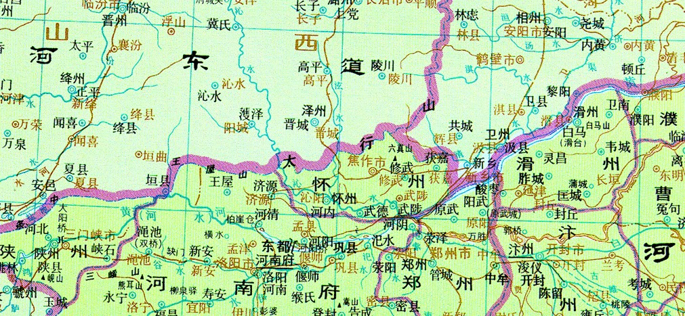
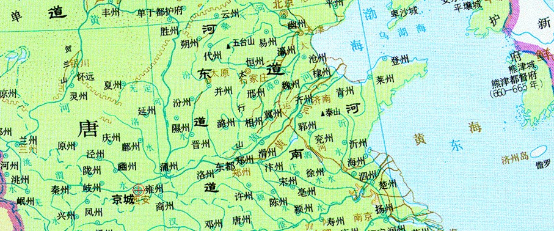

# 唐官员

## 狄仁杰

### 《唐人轶事汇编·卷八》

[^法曹参军]: 法曹。掌管司法的官署。唐朝，在府称法曹参军事，在州称司法参军事；掌管刑法狱讼等事。《新唐书·百官四下》：“法曹司法参军事，掌鞠狱丽法，督（捕）盗贼，知脏贿没入。”宋沿唐制。
[^大理寺丞]: 北齐于大理寺卿、少卿之外置大理寺丞，为卿的佐官。

    隋初沿置，炀帝时改为勾检官，与大理寺正分判狱事。

    唐代复为大理寺丞，员额六人，从六品上，掌分判寺事，正刑之轻重。其断罪不当，则由大理寺正纠正之。所以大理寺正是大理寺的高级法官，大理寺丞是次级法官，与别的寺丞为衙署内部事务官的性质不同。

    明大理寺自少卿以下寺丞、寺正等官都分左右两职，其用意在便于分区任事和互相稽察。寺丞正五品，其地位高于寺正(正六品)。

    清代以左右寺丞分掌左右二寺。
[^尚书仆射]: 隋朝罢录尚书，又常缺令，仆射成为正宰相，从二品，与门下、内史省长官共秉国政。文帝开皇三年 (583) 令左仆射掌判吏、礼、兵三部事，兼纠弹御史所纠不当者; 右仆射掌判都官、度支、工部三部事，兼知用度。行台尚书省亦置，视从二品。
    
    唐朝尚书令罕有除授，高宗龙朔二年 (662) 又废，左、右仆射正式成为尚书省长官，总判省务，从二品。与中书、门下省长官并为宰相，在政事堂共议国政，师长百僚，享礼隆重。本省日常政务由左、右丞监督执行。高宗龙朔二年改名左、右匡政，咸亨元年 (670)复旧; 武则天光宅元年(684)改名文昌左、右相，中宗神龙元年(705)复旧; 玄宗开元元年 (713) 改名左、右丞相，天宝元年 (742) 复旧。贞观二十三年 (649) 以后，例带“同中书门下三品”等号，中宗以后，不带此号而单任仆射者，不得入政事堂参议国政、实际执行宰相职务。玄宗开元 (713—741) 以后多不带此号，逐渐成为安置元老旧臣的荣衔，或缺而不授。


1. 狄梁公爲儿童时，与诸昆 `r n("哥哥,胞兄")` 同游于道，遇善相者海涛法师，惊曰：‘此郎位极人臣，苍生是赖。但恨衰朽 `r n("衰落。或年迈无用")` 之质，所不见尔。’《南部新书》丙。

2. 狄仁杰爲儿童时，门人被害者，县吏就诘之。众咸移对，仁杰坚坐读书。吏责之，仁杰曰：‘黄卷 `r n("书籍。古时为防书蠹，多用黄蘖染纸，因纸色黄，故称为「黄卷」")` 之中，圣贤备 `r n("全部")` 在，犹未对接，何暇偶 `r n("适应")` 俗人而见耶？’以资授汴州判佐 ^[判佐也就是判官的副手。判佐是从八品的司法官。判官是唐时节度使、观察使和防御使这类地方大员的僚属，佐理政事。] 。工部尚书 *阎立本* 黜陟 `r n("（动）罢免和升迁（官职）")` 河南，仁杰爲吏人诬告，立本惊谢曰：‘仲尼云：“观过 `r n("所犯过错")` ，斯 `r n("则")` 知仁 `r n("通“人”")` 矣。” `r n("出自《论语·里仁》")` 足下可谓海曲 ^[海曲县。西汉置，属琅邪郡。治所在今山东日照市西十里。县有盐官。《后汉书·刘玄刘盆子列传》：王莽天凤元年(17)，海曲吕母起义，“自称将军，引兵还攻破海曲”。即此。东汉改名西海县。] 明珠，东南遗宝。’特荐爲并州 ^[并州。西汉武帝置，为“十三刺史部”之一。辖境相当今山西大部及内蒙古、河北的一部。东汉治所在太原郡(今山西太原市西南晋源镇)，辖境扩大，包有今陕西北部及河套地区。三国后渐小。唐代辖境相当今山西阳曲以南、文水以北的汾水中游地区。开元十一年(723)改为太原府。北宋太平兴国四年(979)复改并州，移治阳曲县(今太原市)。嘉祐四年(1059)又改为太原府。] 法曹[^法曹参军]。其亲 `r n("父母或亲戚")` 在河阳 ^[河阳。古邑名。春秋晋邑。在今河南省孟州市西。《春秋》：天王狩于河阳。即此。西汉置为河阳县] 别业 `r n("别墅。与“旧业”或“第宅”相对而言，业主往往原有一处住宅，而后另营别墅")` ，仁杰赴任，于并州登太行，南望白云孤飞，谓左右曰：‘吾亲所居，近此云下！’悲泣，伫立久之，候云移乃行。《大唐新语》六。

```{r city-heyang-bianzhou,fig.cap="唐。河阳、汴州相对位置",out.width='70%',fig.align='center', echo=FALSE}

```

```{r city-bianzhou-bingzhou,fig.cap="唐。京城（关中）、并州、汴州相对位置",out.width='70%',fig.align='center', echo=FALSE}

```

3. 狄仁杰，太原人，爲府法曹参军[^法曹参军]。时同僚 *郑崇资* 母老且病，当充使絶域 `r n("与外界隔绝之地。极远之地")` 。仁杰谓曰：‘太夫人有危亟 `r n("wēi jí。危急")` 之病，而公远使，岂可贻 `r n("yí。遗留")` 亲万里之泣乎？’乃请代崇资。《谭宾録》（《广记》一六六）。　案：新、旧《唐书·狄仁杰传》郑崇资作 *郑崇质* 。

4. 狄梁公 `r n("死后追封 梁国公")` 性閒 `r n("xián。熟练、通晓。通「娴」")` 医药，尤妙针术。显庆 `r n("显庆（656年正月－661年二月）是唐高宗李治的第二个年号。唐朝使用这个年号共5年余。")` 中，应制 `r n("应诏，应皇帝之命")` 入关，路由华州 ^[华州前据华山，后临泾渭，左控潼关，右阻蓝田关，历为关中军事重地。] 。闤闠 `r n("1.街市;街道。2.借指店铺;商业。3.借指民间。")` 之北，稠人广衆，聚观如堵。狄梁公引辔 `r n("牵拉缰绳。指乘马")` 遥望，有巨牌大字云：‘能疗此儿，酬绢千疋 `r n("pǐ。同“匹”")` 。’即就观之，有富室儿，年可 `r n("大约")` 十四五：卧牌下。鼻端生赘，大如拳石，根蒂缀鼻，纔 `r n("从毚（chán）。“毚”意为“拖挂”、“悬持”")` 如食筯，或触之，酸痛刺骨，于是两眼爲赘所缒 `r n("zhuì。拽;拉")` ，目睛翻白，痛楚危亟，顷刻将絶。恻然 `r n("悲伤的样子")` 久之，乃曰：‘吾能爲也。’其父母洎 `r n("jì。到，及")` 亲属叩颡 `r n("kòu sǎng。磕头")` 祈请，即辇 `r n("载运;运送")` 千缣 `r n("jiān。双丝的细绢")` ，置于坐侧。公因 `r n("于是，就")` 令扶起，即于脑后下针寸许，仍询病者曰：‘针气已达病处乎？’病人颔之。公遽抽针，而疣赘应手而落，双目登亦如初，曾 `r n("乃，竟 [actually]")` 无病痛。其父母亲眷，且泣且拜，则以缣物奉焉。公笑曰：‘吾哀尔命之危逼 `r n("危迫；危急")` ，吾盖 `r n("因为，由于")` 急病行志 `r n("行志。随意志行事")` 耳，吾非鬻伎 `r n("yù jì。亦作“鬻技”。出卖技术、以技艺谋生，卖弄本领，炫耀高明")` 者也。’不顾而去焉。《集异记》二。

5. 上元 `r n("唐朝高宗的年号。（西元674～676)​")` 二年，大理寺丞[^大理寺丞]狄仁杰考中上，考使尚书左仆射[^尚书仆射] *刘仁轨* 以新任不録 `r n("採取，任用")` ，大理卿 *张文瓘* 称独知 `r n("主管")` 理司 `r n("理司。狱讼刑罚")` 之要，仁轨乃惊问：‘公断几何狱？’文瓘曰：‘岁竟，凡断一万七千八百人。’仁轨乃擢 `r n("提拔，提升")` 爲上下考 `r n("《新唐书·卷46·尚书省·吏部》流内之官，叙以四善。。。善状之外有二十七最。。。。一最二善为上下；无最而有二善为中上。。。凡考，中上以上，每进一等，加禄一季；中中，守本禄；中下以下，每退一等，夺禄一季。中品以下，四考皆中中者，进一阶；一中上考，复进一阶；一上下考，进二阶；")` 《唐会要》八一。《独异志》下。

6. *权善才* ，高宗朝爲将军，中郎将范怀义宿衞昭陵，有飞骑犯法，善才绳之。飞骑因番请见，先涕泣不自胜，言善才等伐陵柏，大不敬。高宗悲泣不自胜，命杀之。大理丞狄仁杰断善才罪止免官。高宗大怒，命促刑。仁杰曰：‘法是陛下法，臣仅守之。奈何以数株小柏而杀大臣？请不奉诏。’高宗涕泣曰：‘善才斫我父陵上柏，我爲子不孝，以至是。知卿好法官，善才等终须死。’仁杰固谏，侍中张文瓘以笏挥令出，仁杰乃引张释之高庙、辛毗牵裾之例，曰：‘臣闻逆龙鳞，忤人主，自古以爲难，臣以爲不难。居桀纣时则难，尧舜时则不难。臣今幸逢尧舜，不惧比干之诛。陛下不纳臣言，臣瞑目之后，羞见释之、辛毗于地下。’高宗曰：‘善才情不可容，法虽不死，朕之恨深矣，须法外杀之。’仁杰曰：‘陛下作法，悬诸象魏，徒流及死，具有等差，岂有罪非极刑，特令赐死？法既无恒，万方何所措其手足？陛下必欲变法，请今日爲始。’高宗意乃解，曰：‘卿能守法，朕有法官。’命编入史。又曰：‘仁杰爲善才正朕，岂不能爲朕正天下耶？’授侍御史。后因谏事，高宗笑曰：‘卿得权善才便也。’时左司郎中王本立恃宠用事，朝廷惧之，仁杰按之，请付法。高宗特原之，仁杰奏曰：‘虽国之英秀，岂少本立之类。陛下何惜罪人，而亏王法？必不欲推问，请曲赦之，弃臣于无人之境，以爲忠贞将来之戒。’高宗乃许之。由是朝廷肃然。《大唐新语》四。

7. 狄仁杰因使岐州，遇背军士卒数百人，夜纵剽掠，昼潜山谷，州县擒捕繫狱者数十人。仁杰曰：‘此途穷者，不辑之，当爲患。’乃明榜要路，许以陈首。仍出繫狱者，廪而给遣之。高宗喜曰：‘仁杰识国家大体。’乃颁示天下，宥其同类，潜窜毕首矣。《大唐新语》四。
8. 狄仁杰爲度支员外郎，车驾将幸汾阳宫，仁杰奉使先脩官顿。并州长史李玄冲以道出妒女祠，俗称有盛衣服车马过，必致雷风之异，欲别开路。仁杰谓曰：‘天子行幸，千乘万骑，风伯清尘，雨师洒道，何妒女之敢害而欲避之！’玄冲遂止，果无他变。上闻之，叹曰：‘可谓真丈夫也！’《封氏闻见记》九。《唐语林》三。《唐会要》二七亦载此事，繫于高宗调露元年。
9. 后爲冬官侍郎，充江南安抚使，吴、楚风俗，岁时尚淫祀，祠庙凡一千七百馀所，仁杰并令焚之。有项羽神，号爲楚王庙，祈祷至多，爲吴人所惮。仁杰先致檄书，责其丧失江东八千子弟而妄受牲牢之荐，然后焚除。《封氏闻见记》九。《唐语林》三。
10. 唐垂拱四年，安抚大使狄仁杰檄告西楚霸王项君将校等，略曰：‘鸿名不可以谬假，神器不可以力争，应天者膺乐推之名，背时者非见机之主。自祖龙御，横噬诸侯，任赵高以当轴，弃蒙恬而齿剑。沙丘拚祸于前，望夷覆灭于后，七庙堕圮，万姓屠原，鸟思静于飞尘，鱼岂安于沸水。赫矣皇汉，受命玄穹，膺赤帝之镇符，当素灵之缺运。俯张地纽，彰凤举之符，仰缉天纲，鬱龙兴之兆。而君潜游泽国，啸聚水乡，矜扛鼎之雄，逞拔山之力，莫测天符之所会，不知曆数之有归。遂奋关中之翼，竟垂垓下之翅，盖尽由于人事，焉有属于天亡！虽驱百万之兵，终弃八千之子。以爲殷鑑，岂不惜哉！当匿魄东峯，收魂北极，岂合虚承庙食，广费牲牢。仁杰受命方隅，循革攸寄，今遣焚燎祠宇，削平台室，使蕙销烬，羽帐随烟，君宜速迁，勿爲人患。檄到如律令。’遂除项羽庙，馀小神并尽，惟会稽禹庙存焉。《朝野佥载》（张本《説郛》二）。《广记》三一五引作《吴兴掌故集》。
11. 狄内史仁杰始爲江南安抚使，以周赧王、楚王项羽、吴王夫差、越王勾践、吴夫槩王、春申君、赵佗、马援、吴桓王等神庙七百馀所，有害于人，悉除之。惟夏禹、吴太伯、季札、伍胥四庙存焉。《隋唐嘉话》下。《唐语林》三。
12. 则天将不利王室，越王贞于汝南举兵，不克，士庶坐死者六百馀人，没官人五千馀口，司刑使相次而至，逼促行刑。时狄仁杰检校刺史，哀其诖误，止司刑使，停斩决，飞奏表曰：‘臣欲闻奏，似爲逆人论理；知而不言，恐乖陛下存恤之意。奏成复毁，意不能定。此辈非其本心，愿矜其诖误。’表奏，特敕配流丰州。诸囚次于宁州，宁州耆老郊迎之，曰：‘我狄使君活汝耶！’相携哭于碑侧，斋三日而后行。诸囚至丰州，复立碑纪德。初，张光辅以宰相讨越王，既平之后，将士恃威，徵敛无度，仁杰率皆不应。光辅怒曰：‘州将轻元帅耶？何徵发之不赴？’仁杰〔曰〕：‘汝南勃乱，一越王（耶）〔耳〕。（仁杰曰）今一越王已死，而万越王生。’光辅质之，仁杰曰：‘明公亲董戎旃二十馀万，所在劫夺，远迩流离，创钜之馀，肝脑涂地。此非一越王死而万越王生耶？且脇从之徒，势不自固，所以先著纲理之也。自天兵暂临，其弃城归顺者不可胜计，绳坠四面成蹊，奈何纵求功之人，杀投降之士？但恐冤声腾沸，上彻于天，将请尚方（断）〔斩〕马剑斩足下，当北面请命，死犹生也。’遂爲光辅所谮，左授复州刺史。寻徵还魏州刺史，威惠大行，百姓爲立生祠。迁内史，及薨，朝野悽恸。则天赠文昌左相，中宗朝赠司空，睿宗朝追封梁国公，哀荣备于三朝，代莫与爲比。《大唐新语》四。　案：原文有误，据《旧唐书》本传改。
13. 狄仁杰爲内史，则天谓之曰：‘卿在汝南，甚有善政，欲知谮卿者乎？’仁杰谢曰：‘陛下以臣爲过，臣当改之；陛下明言，臣之幸也。若臣不知谮者，并爲友善，臣请不知。’则天深加歎异。《大唐新语》七。
14. 见来俊臣2。

15. 唐狄仁杰之贬也，路经汴州，欲留半日医疾，开封县令霍献可追逐当日出界，狄公甚衔之。及回爲宰相，霍已爲郎中，狄欲中伤之而未果。则天命择御史中丞，凡两度承旨，皆忘。后则天又问之，狄公卒对，无以应命，唯记得霍献可，遂奏之，恩制除御史中丞。后狄公谓霍曰：‘某初恨公，今却荐公，乃知命也，岂由于人耶？’《定命録》（《广记》一四六）。
16. 魏州南郭狄仁杰庙，即生祠堂也。天后朝，仁杰爲魏州刺史，有善政，吏民爲之立生祠。及入朝，魏之士女，每至月首皆诣祠奠醊。仁杰方朝，是日亦有醉色，天后素知仁杰初不饮酒，诘之，具以事对。天后使验问乃信。《玉堂閒话》（《广记》三一三）。
17. 《新唐史·狄仁杰传》载仁杰转幽州都督，赐紫袍龟带，后自制金字十二于袍，以旌其忠。其十二字史不著。予按，《家传》云：‘以金字环绕五色双鸾，其文曰：“敷政术，守清勤。昇显位，励相臣。”乃命録之。’《新史》不惟不著十二字，虽‘五色双鸾’亦不録也。《能改斋漫録》一四。
18. 见娄师德6、7。
19. 唐天后既立国号周，又欲立三思爲后。狄仁杰切谏，上曰：‘奈何有武氏临朝万万年之謡？’公对曰：‘陛下改万岁登封元年，又改万岁通天元年，又改大足元年，则万万之数足矣。’武后大悟，始有归中宗之意。《纪异録》（《分门古今类事》一五）。　案：狄仁杰卒于圣曆三年，此条叙事年代有误。
20. 后纳诸武之议，将移宗社，拟立武三思爲储副，迁庐陵王于房陵。诸武阴计，日夜献谋曰：‘陛下姓武，合立武氏，未有天子而取别姓将爲后者也。’天后既已许，礼问羣臣曰：‘朕年齿将衰，国无储主，今欲择善，谁可当之？朕虽得人，终在羣议。’诸宰臣多闻计定，言皆希旨；仁杰独退立，寂无一言。天后问曰：‘卿独无言，当有异见。’公曰：‘有之。臣上观乾象，无易主之文；中察人心，实未厌唐德。’天后曰：‘卿何以知之？’公曰：‘顷者匈奴犯边，陛下使梁王三思于都市召募，一月之外，不满千人。后庐陵王踵之，未经二旬，数盈五万。以此观之，人心未去。陛下将欲继统，非庐陵王，馀实非臣所知。’天后震怒，命左右扶而去之。《狄梁公传》（《通鑑考异》一一）。　案：《通鑑考异》有考辨之言。
21. 后经旬，召公入，曰：‘朕昨夜梦与人双陆，频不见胜，何也？’对曰：‘双陆不胜，盖爲宫中无子。此是上天之意，假此以示陛下，安可久虚储位哉？’天后曰：‘是朕家事，断在胸中，卿岂合预焉！’仁杰对曰：‘臣闻王者以天下爲家，四海之内，悉爲臣妾，何者不爲陛下家事！君爲元首，臣爲股肱，臣安得不预焉！’又命扶出，竟不纳。《狄梁公传》（《通鑑考异》一一）。参看王方庆2。

22. 则天后尝梦一鹦鹉，羽毛甚伟，两翅俱折。以问宰臣，羣公默然，内史狄仁杰曰：‘鹉者，陛下姓也；两翅折，陛下二子庐陵、相王也。陛下起此二子，两翅全也。’武承嗣、武三思连项皆赤。后契丹围幽州，檄朝廷曰‘还我庐陵、相王来’，则天乃忆狄公之言，曰：‘卿曾爲我占梦，今乃应矣。朕欲立太子，何者爲得？’仁杰曰：‘陛下内有贤子，外有贤姪，取舍详择，断在圣衷。’则天曰：‘我自有圣子，承嗣、三思是何疥癣！’承嗣等惧，掩耳而走。即降敕追庐陵，立爲太子，充元帅。初募兵，无有应者，闻太子行，北邙山头皆兵满，无容人处。贼自退散。《朝野佥载》三。《金銮密记》（陶本《説郛》四九）。　案：《通鑑考异》一一引《朝野佥载》此文，‘即降敕追庐陵’下有‘河内王奏，不许入城，龙门安置。贼徒转盛，陷没冀州，则天急’数句。‘立爲太子’，引作‘乃立庐陵王爲太子’。
23. 天后御一小殿，垂帘于后，左右隐蔽，外不能知，乃命公坐于阶下，曰：‘前者所议，事实非小，寤寐反覆，思卿所言，弥觉理非甚乖。朕意忠臣事主，岂在多违！今日之间，须易前见。以天下之位在卿一言，可朕意即两全，逆朕心即俱毙！’公从容言曰：‘陛下所言，天子之位，可得专之。以臣所知，是太宗文武皇帝之位，陛下岂得而自有也！太宗身陷锋镝，经纶四海，所以不告劳者，盖爲子孙，岂爲武三思邪！陛下身是大帝皇后，大帝寝疾，权使陛下监国；大帝崩后，合归冢嫡。陛下遂奄有神器，十有馀年。今议缵承，岂可更异！且姑与母孰亲？子与姪孰近？’云云。天后于是歔欷流涕，命左右褰帘，手抚公背，大叫曰：‘卿非朕之臣，是唐社稷之臣！’回谓庐陵王曰：‘拜国老！今日国老与尔天子！’公免冠顿首，涕血洒地，左右扶策，久不能起。天后曰：‘即具所言，宣付中外，择日礼册。’公挥涕而言曰：‘自古以来，岂有偷人作天子！庐陵王留在房州，天下所悉知，今日在内，臣亦不知。臣欲奉诏，若同衞太子之变，陛下何以明臣？’天后曰：‘安可却向房陵！只于石像驿安置，具法驾，陈百僚，就迎之。’于是大呼万岁，储位乃定。《狄梁公传》（《通鑑考异》一一）。　案：《通鑑考异》有考辨之言。
24. 圣曆三年，则天曰：‘朕令宰相各举尚书郎一人。’狄仁杰独荐男光嗣，由是拜地官尚书郎。莅事有声，则天谓仁杰曰：‘祁奚内举，果得人也。’《唐会要》五三。又《广记》一八五引。
25. 见张柬之2。
26. 张柬之、桓彦范、敬晖、崔玄暐、袁恕己皆公所荐。公尝退食之后，谓五公曰：‘所恨衰老，身先朝露，不得见五公盛事，冀各保爱，愿尽本心。’五公心知目击，悬悟公意。公寝疾，五公候问，偶对终日，竟无一言。少顷，流涕及枕，但相视而已。五公退出，递不测其由。袁恕己曰：‘岂不气力转羸，须问家事乎？’张柬之曰：‘未有大贤废国谋家者也。’斯须，命张柬之、袁恕己、桓彦范三公入，馀二公立于门外，曰：‘向者无言，盖以二公之故。此二公能断而不能密，若先与议之，事必外泄，一泄之后，则国异而家亡也。至其时或不与共之，事亦不就。梁王三思掌权，可先收而后行也。不然，则必反生大祸。’狄公没后，经岁馀，五公潜会于幽閒之处，叙公当时之言，重结盟约。彻馔之后，相顾欲言，未至其时，恐负前诺，欲言又止，前后数四，桓彦范乃叙其言。言犹未毕，闻户牖之外，声若雷霆，须臾风雨，咫尺莫辨，所坐牀褥悉掷于阶下。五公战惧，不知所据，乃相谓曰：‘此是狄公忠烈之至，假此灵变以惊衆心，不欲吾辈先论此事，未至其时，不可复言也。’斯须，天清日明，不异于初。易之等既诛，袁谓张公曰：‘昔有遗言，使先收三思，岂可捨诸？’张公曰：‘但大事毕功，此是机上之物，岂有逃乎！’后梁王交通于内，王公果爲所谮，俱遭流窜。所期兴废年月，遗约轨模少无异也。《狄梁公传》（《通鑑考异》一一）。　案：《通鑑考异》曰：‘此盖作传者因五人建兴复之功，附会其事，云皆仁杰所举，受教于仁杰耳。其言谲怪无稽，今所不取。’
27. 狄梁公既立中宗，荐张柬之、袁恕己、桓彦范、崔玄暐、敬晖，五公咸出门下，皆自州县拔居显名，外以爲五公爲一代之盛桃李也。《庐陵王传》（《演繁露》一一）。

28. 狄仁杰之爲相也，有卢氏堂姨居于午桥南别墅。姨止有一子，而未尝来都城亲戚家。梁公每遇伏腊晦朔，修礼甚谨。尝经甚雪多休暇，因候卢姨安否，适见表弟挟弓矢携雉兔来归，膳味进于北堂。顾揖梁公，意甚轻简。公因啓姨曰：‘某今爲相，表弟有何乐从，愿悉力以从其旨。’姨曰：‘相自贵尔，有一子不欲令其事女主。’公大惭而退。《松窗杂録》。又《广记》二七一引。《唐语林》四。《古今合璧事类备要》前集三六引作《朝野佥载》，误。
29. 则天时，南海郡献集翠裘，珍丽异常。张昌宗侍侧，则天因以赐之，遂命披裘，供奉双陆。宰相狄梁公仁杰时入奏事，则天令畀座，因命梁公与昌宗双陆，梁公拜恩就局。则天曰：‘卿二人赌何物？’梁公对曰：‘争先三筹，赌昌宗所衣毛裘。’则天谓曰：‘卿以何物爲对？’梁公指所衣紫絁袍曰：‘臣以此敌。’则天笑曰：‘卿未知此裘价逾千金，卿之所指，爲不等矣。’梁公起曰：‘臣此袍乃大臣朝见奏对之衣，昌宗所衣乃嬖倖宠遇之服，对臣之袍，臣犹怏怏。’则天业已处分，遂依其説。而昌宗心赧神沮，气势索莫，累局连北。梁公对御就褫其裘，拜恩而出。及至光范门，遂付家奴衣之，乃促马而去。《集异记》二。又《广记》四〇五引。
30. 武后信重狄仁杰，羣臣莫及，常谓之国老而不名。仁杰好面折廷诤，太后每屈意从之。尝从太后游幸，遇风吹仁杰巾坠，而马惊不能止，太后命太子追执其鞚而繫之。仁杰屡以老病乞骸骨，太后不许。入见常止其拜，曰：‘每见公拜，朕亦身痛。’仁杰薨，太后泣曰：‘朝堂空矣。’《续世説》五。
31. 唐狄仁杰倜傥不羁，尝授司农员外郎，每判事，多爲正员卿同异。仁杰不平之，乃判曰：‘员外郎有同侧室，正员卿位擅嫡妻，此难曲事女君，终是不蒙顔色。’正员颇亦慙悚。时王及善、豆卢钦望拜左右相，仁杰以才望时议归之，颇冀此命，每戏王、豆卢，略无屈色。王、豆卢俱善长行，既拜，谓时宰曰：‘某无材行，滥有此授。’狄谓曰：‘公二人并能长行，何谓无材行？’或曰左相事，云适已白右相，狄谓曰：‘不审唤爲右相，合呼爲有相。’王、豆卢问故，狄曰：‘公不闻：聪明儿不如有相子，公二人可谓有相子也。’二公强笑，意亦悒悒。《御史台记》（《广记》二五四）。
32. 秋官侍郎狄仁杰嘲秋官侍郎卢献曰：‘足下配马乃作驴。’献曰：‘中劈明公，乃成二犬。’杰曰：‘狄字犬傍火也。’献曰：‘犬边有火，乃是煮熟狗。’《朝野佥载》六。